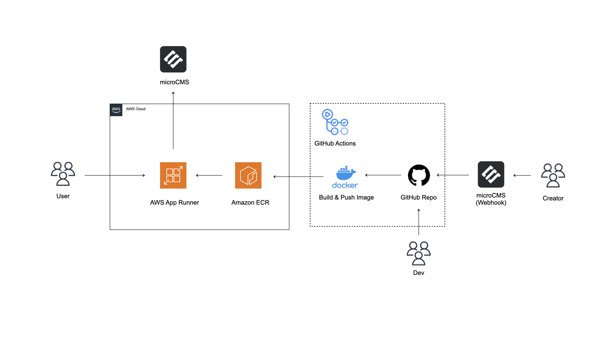

# Ryota Blog Frontend

## Architecture Diagram



## Project Overview

This repository manages the frontend of `Ryota Blog`, a blog platform built using the latest technology stack.

↓ Web Page
https://ryotablog.jp/blogs

## Technology Stack

### Frontend

- **[TypeScript](https://www.typescriptlang.org/)**: A strongly typed programming language that builds on JavaScript.
- **[Next.js App Router](https://nextjs.org/docs)**: A React framework enabling server-side rendering and static site generation.
- **[TailwindCSS](https://tailwindcss.com/)**: A utility-first CSS framework for rapid styling.
- **[html-react-parser](https://github.com/remarkablemark/html-react-parser)**: A library to convert HTML strings into React components.

### Backend

- **[microCMS](https://microcms.io/)**: A content management system used for managing the blog's content.

## Environment Variables

This project requires some environment variables. Create a `.env.local` file at the root of the project and set the following:

```
MICROCMS_API_KEY=your_microcms_api_key
MICROCMS_SERVICE_DOMAIN=your_microcms_service_domain
```

## Other

↓ This repository contains the Terraform configuration files to manage AWS services
https://github.com/ryota-09/ryota-blog-infra

---

For more details about the frontend part of `Ryota Blog`, refer to the official documentation or comments within the repository. If you have any questions or need support, create an issue or contact the maintainers.