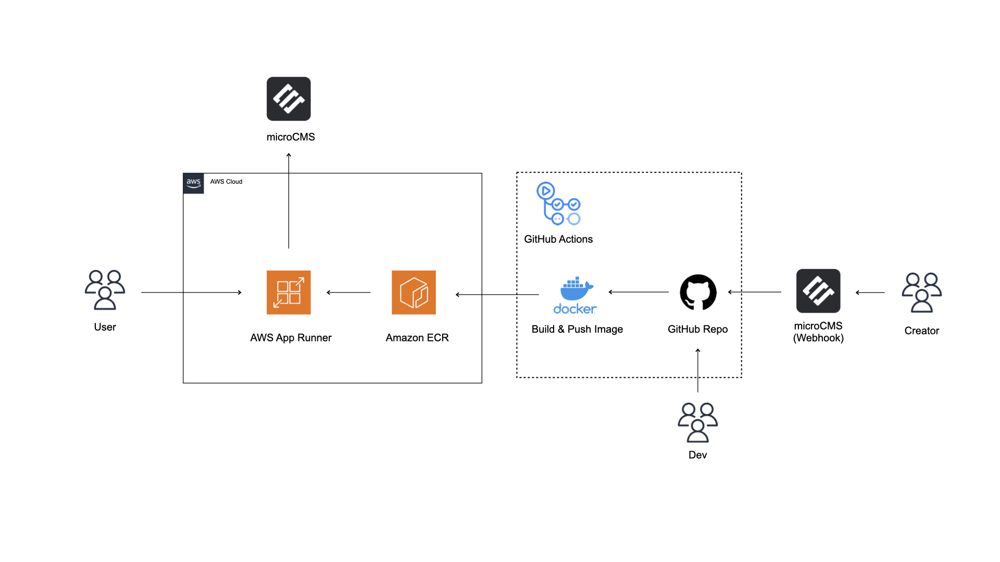

# Ryota Blog Frontend

## Architecture Diagram

## Project Overview

This repository manages the frontend of `Ryota Blog`, a blog platform built using the latest technology stack.

↓ Web Page  
https://ryotablog.jp/blogs  
  
↓ Storybook  
https://story.ryotablog.jp

## Technology Stack

### Frontend

- **[TypeScript](https://www.typescriptlang.org/)**: A strongly typed programming language that builds on JavaScript.
- **[Next.js App Router](https://nextjs.org/docs)**: A React framework enabling server-side rendering and static site generation.
- **[TailwindCSS](https://tailwindcss.com/)**: A utility-first CSS framework for rapid styling.
- **[MDX](https://mdxjs.com/)** / **[html-react-parser](https://github.com/remarkablemark/html-react-parser)**: Used to render blog content (MDX components / legacy inline HTML blocks) as React components.

### Content

- **[Velite](https://velite.js.org/)**: Builds and type-validates blog content from local MDX files under `content/`. The site is fully file-based; there is no external CMS API call at runtime.

  This repository previously used [microCMS](https://microcms.io/) as a headless CMS backend. Content was migrated to file-based MDX (see `docs/adr/0001-content-layer.md` and `docs/migration-parity-report.md`). A snapshot of the original microCMS data is preserved in the `microcms-backup-2026-07-06` GitHub Release for reference; see `docs/rollback-plan.md` for rollback procedures.

## Environment Variables

This project no longer requires any CMS API keys. See `.dev.vars.example` for the local development variables (admin Basic auth, etc.).

## Other
  
↓ This repository contains the Terraform configuration files to manage AWS services  
https://github.com/ryota-09/ryota-blog-infra

For more details about the frontend part of `Ryota Blog`, refer to the official documentation or comments within the repository. If you have any questions or need support, create an issue or contact the maintainers.

This repository is monitored by slack-claude-responder.