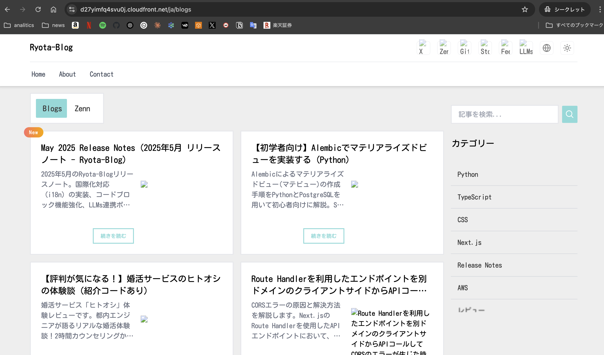

Hello! I'm [@Ryo54388667](https://x.com/Ryo54388667)! ☺️

I work as an engineer in Tokyo, primarily dealing with TypeScript and Next.js technologies.

Today, I'll thoroughly explain the **image optimization errors that occur when combining CloudFront and Next.js**, sharing my journey from encountering the problem to achieving a complete solution!

This article is especially helpful for those struggling with the "`url parameter is not allowed`" error when accessing staging environments via CloudFront, or those experiencing image display issues with App Runner and CloudFront integration.

## Problem Overview 📋

### Symptoms Encountered

Let me start by detailing the problem I encountered.

**Environment Setup**

- **Backend**: AWS App Runner
- **CDN**: CloudFront
- **Framework**: Next.js (with image optimization features)

**Browser**

image 404...😭



<br />

**Error Details**

```plaintext
/_next/image?url=%2Ficons%2Fgithub.webp&w=48&q=75
↓
400 Bad Request: "url" parameter is not allowed
```

Have you seen this error before? 😅 When accessing through a CloudFront domain (`xxxxxx.cloudfront.net`), the site itself displays correctly, but only the images appear as blank white spaces.

### Why Does This Problem Occur?

Through investigation, I discovered three root causes for this issue:

1. **Host Header Mismatch Issue**

   - CloudFront sends requests to App Runner with the Host header still set to the CloudFront domain
   - App Runner expects requests with its own domain name, causing routing failures
   - Example: CloudFront sends `Host: xxxxxx.cloudfront.net` but App Runner expects `Host: xxxxx.ap-northeast-1.awsapprunner.com`

2. **Query Parameter Forwarding Issues**

   - Query parameters required for Next.js image optimization (`url`, `w`, `q`) are not properly forwarded
   - CloudFront configuration may discard query parameters
   - Example: Parameters in `/_next/image?url=%2Ficons%2Fgithub.webp&w=48&q=75` don't reach the destination

3. **Base URL Configuration Conflicts**

   - Mismatch between `NEXT_PUBLIC_BASE_URL` settings and access domain
   - This configuration error can trigger circular dependency errors
   - Next.js references incorrect base URLs when internally generating image optimization URLs

### How Next.js Image Optimization Works

Let me briefly explain Next.js image optimization functionality:

```jsx title="component.jsx"
// Next.js Image component usage example
import Image from 'next/image'

export default function MyComponent() {
  return (
    <Image
      src="/icons/github.webp"
      alt="GitHub Icon"
      width={48}
      height={48}
    />
  )
}
```

This component actually generates URLs like this:

```plaintext
/_next/image?url=%2Ficons%2Fgithub.webp&w=48&q=75
```

- `url`: Original image path (URL encoded)
- `w`: Display width
- `q`: Quality (1-100 value)

This `/_next/image` endpoint is Next.js's image optimization API, which resizes and optimizes images in real-time. Therefore, **if query parameters don't reach this endpoint correctly, images won't display**.

Initially, I wondered "Why do only images fail...?" but it's because only the image optimization feature requires special query parameters, while other resources displayed normally.

## Trial and Error Process Toward Solution 🔍

### Phase 1: Initial Diagnosis and Basic Fixes

I first tried reviewing basic configurations.

```bash title="terminal"
# Terraform configuration check
terraform plan
terraform apply

# App Runner and CloudFront status verification
aws apprunner describe-service --service-arn xxx
aws cloudfront get-distribution --id xxx
```

At this stage, I changed `NEXT_PUBLIC_BASE_URL` to the CloudFront domain, which was a **major mistake** 😅

```terraform title="main.tf"
// ❌ Incorrect configuration
NEXT_PUBLIC_BASE_URL=https://xxxxxx.cloudfront.net

// This configuration caused circular dependency errors
```

Circular dependency errors occurred, making the App Runner service itself unstable.

**Circular Dependency Error Details:**

- Next.js app references the CloudFront domain specified in `NEXT_PUBLIC_BASE_URL`
- CloudFront forwards that request back to App Runner
- App Runner redirects again to the CloudFront domain
- This repetition creates an infinite loop

At this point, I realized that "basic configuration changes alone won't solve this."

### Phase 2: Detailed CloudFront Configuration Adjustments

Next, I tried making more granular adjustments to CloudFront settings.

```hcl title="main.tf"
# Configuration example attempted
ordered_cache_behavior {
  path_pattern     = "_next/image*"
  allowed_methods  = ["GET", "HEAD", "OPTIONS"]
  cached_methods   = ["GET", "HEAD", "OPTIONS"]
  
  cache_policy_id            = "4135ea2d-6df8-44a3-9df3-4b5a84be39ad" # CachingDisabled
  origin_request_policy_id   = "216adef6-5c7f-47e4-b989-5492eafa07d3" # AllViewer
}
```

This configuration showed temporary improvement, but the `AllViewer` policy caused compatibility issues with App Runner. Particularly, unexpected behavior occurred with Host Header handling, affecting other endpoints as well.

**Specific problems with AllViewer policy:**

- Host Header forwarded as CloudFront domain
- App Runner routing triggers CORS errors
- Impact spreads to other API endpoints (`/api/*`)
- Response times become abnormally long (timeouts occur)

Thinking "Managed policies sometimes have traps..." I decided to try the next approach.

### Phase 3: Reverting to Legacy Settings

Due to managed policy issues, I tried reverting to legacy `forwarded_values` settings.

```hcl title="main.tf"
# Configuration example attempted
forwarded_values {
  query_string = true  # Forward all query parameters
  headers      = ["Origin", "Accept", "Host"]
  
  cookies {
    forward = "none"
  }
}
```

This configuration made the site display, but **the 400 error for images persisted**.

At this point, I was convinced that "the cause lies in something more fundamental than configuration issues" and began deeper investigation.

## Final Solution Discovery and Implementation 💡

### Root Cause Identification

Through web research, the following crucial facts emerged:

- **CloudFront's&#x20;**`CORS-S3Origin`**&#x20;policy doesn't forward query parameters**

  - Designed for S3, it doesn't support dynamic query parameter forwarding
  - Inappropriate for dynamic processing like Next.js image optimization

- **App Runner requires its own domain name in Host headers**

  - App Runner's routing functionality identifies requests based on Host Headers
  - CloudFront domain Host headers prevent App Runner from processing correctly

- `AllViewerExceptHostHeader`**&#x20;policy is the solution to this problem**

  - Forwards all request information except Host Header
  - CloudFront automatically rewrites Host Header to origin domain

**Helpful information sources:**

- [AWS CloudFront managed policies](https://docs.aws.amazon.com/AmazonCloudFront/latest/DeveloperGuide/using-managed-origin-request-policies.html)
- [Next.js image optimization with CloudFront best practices](https://nextjs.org/docs/basic-features/image-optimization#cloud-providers)
- [App Runner Host header requirements](https://docs.aws.amazon.com/apprunner/latest/dg/manage-custom-domains.html)

This discovery was the turning point! 🎉

### Final Solution Implementation

**1. Adding Data Source**

```hcl title="main.tf"
# Adding AllViewerExceptHostHeader policy data source
data "aws_cloudfront_origin_request_policy" "all_except_host" {
  name = "Managed-AllViewerExceptHostHeader"
}
```

**2. Unifying All Cache Behaviors**

```hcl title="main.tf"
# Default cache behavior
default_cache_behavior {
  cache_policy_id            = "658327ea-f89d-4fab-a63d-7e88639e58f6" # CachingOptimized
  origin_request_policy_id   = data.aws_cloudfront_origin_request_policy.all_except_host.id
  # Other settings...
}

# Image optimization specific behavior
ordered_cache_behavior {
  path_pattern               = "_next/image*"
  cache_policy_id            = "4135ea2d-6df8-44a3-9df3-4b5a84be39ad" # CachingDisabled
  origin_request_policy_id   = data.aws_cloudfront_origin_request_policy.all_except_host.id
  # Other settings...
}

# Static assets behavior
ordered_cache_behavior {
  path_pattern               = "_next/static/*"
  cache_policy_id            = "658327ea-f89d-4fab-a63d-7e88639e58f6" # CachingOptimized
  origin_request_policy_id   = data.aws_cloudfront_origin_request_policy.all_except_host.id
  # Other settings...
}
```

## AWS Managed Policies Used - Detailed Overview 📊

Here's a summary table of the managed policies used for this solution:

| Policy Name                   | Policy ID                              | Purpose                                 | Key Points               |
| ----------------------------- | -------------------------------------- | --------------------------------------- | ------------------------ |
| **AllViewerExceptHostHeader** | `b689b0a8-53d0-40ab-baf2-68738e2966ac` | Auto Host Header rewriting              | 🔑 Most critical policy  |
| **CachingDisabled**           | `4135ea2d-6df8-44a3-9df3-4b5a84be39ad` | Image optimization (dynamic processing) | For real-time processing |
| **CachingOptimized**          | `658327ea-f89d-4fab-a63d-7e88639e58f6` | Static asset caching                    | Performance improvement  |

### Why AllViewerExceptHostHeader Policy is Critical

The excellent features of this policy include:

1. **Automatic Host Header Rewriting**

   - CloudFront automatically changes Host Header to App Runner domain
   - Enables App Runner to route correctly
   - Example: `Host: xxxxxx.cloudfront.net` → `Host: xxxxx.ap-northeast-1.awsapprunner.com`

2. **Complete Request Information Forwarding**

   - Reliably forwards all query parameters (`url`, `w`, `q`, etc.)
   - Properly forwards important header information like Accept, User-Agent, Authorization
   - Preserves cookies and referrer information

3. **Configuration Simplicity**

   - No need for complex `forwarded_values` settings
   - No need to specify individual headers or query parameters
   - AWS-managed, ensuring future compatibility

4. **Performance Optimization**

   - Reduces overhead by avoiding unnecessary Host Header forwarding
   - Speeds up App Runner routing processing
   - Improves CDN cache efficiency

**Comparison with legacy forwarded\_values settings:**

```hcl title="comparison.tf"
# ❌ Legacy complex configuration
forwarded_values {
  query_string = true
  headers = [
    "Authorization", 
    "Accept", 
    "Accept-Language", 
    "Accept-Encoding",
    "Origin",
    "Referer",
    "User-Agent"
    # Host needs to be excluded but individual specification is cumbersome
  ]
  cookies {
    forward = "all"
  }
}

# ✅ Using AllViewerExceptHostHeader policy
origin_request_policy_id = data.aws_cloudfront_origin_request_policy.all_except_host.id
# Done in just one line above!
```

## Verification Results and Effects ✅

### Before Fix

- ❌ Site accessible via CloudFront but images not displayed
- ❌ 400 Bad Request at `/_next/image` endpoint
- ❌ Host Header mismatch and query parameter forwarding issues

### After Fix

- ✅ Site completely displays including images via CloudFront
- ✅ Next.js image optimization functions normally
- ✅ Speed improvement due to static asset cache effects
- ✅ Improved configuration reliability through managed policies

When I confirmed the site after the fix, I was truly happy! 🎉

## Summary 🎯

Through solving this CloudFront + Next.js image optimization error, the following key points became clear:

### ✅ Key Solution Points

1. **Introduction of&#x20;**`AllViewerExceptHostHeader`**&#x20;policy** - Fundamental solution to Host Header issues
2. **Proper cache policy differentiation** - Balancing performance and functionality
3. **Systematic debugging approach** - Essential understanding of problem nature

### ✅ Technical Achievements

- Complete functionality of Next.js image optimization via CloudFront
- Simplified and reliable configuration through managed policy utilization
- Performance improvements (static asset cache effects)

### ✅ Future Applications

- Applicable as knowledge for other Next.js + CDN configurations
- Best practices when using App Runner
- Reference for effective AWS managed policy utilization

While CloudFront and Next.js combinations can become complex in configuration, this demonstrates that proper approaches can definitely solve such issues. I hope this helps others facing similar problems!

If you know better methods or have additional improvement suggestions, please let me know! 🙇‍♂️

\
**Test Environment**: AWS App Runner + CloudFront + Next.js\
**Resolution Date**: 2025-06-21\
**Result**: ✅ Complete functionality of image optimization via CloudFront

Thank you for reading to the end!

I post casually on social media, so feel free to follow! 🥺
