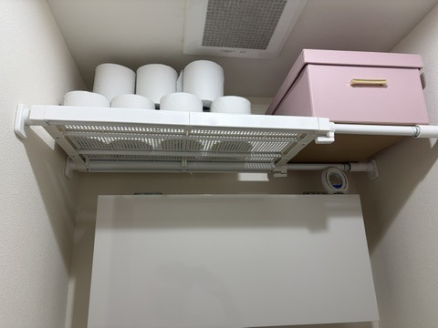
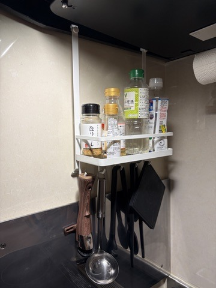
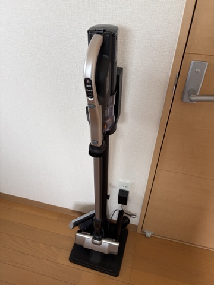
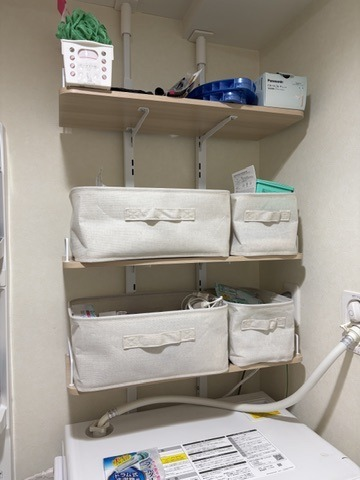
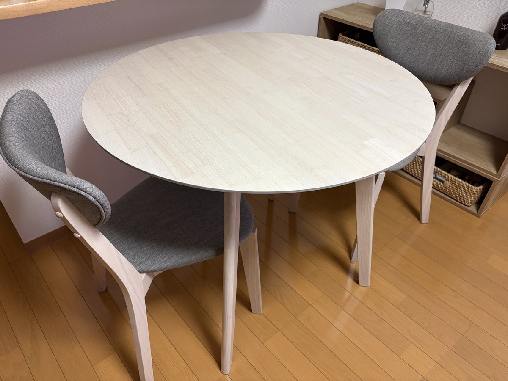
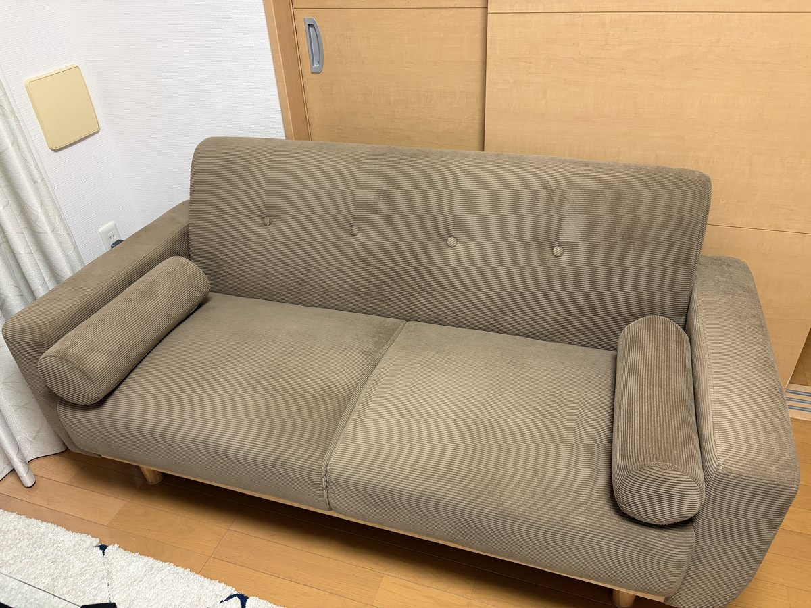
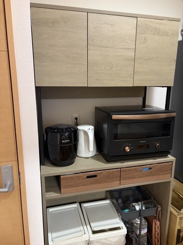
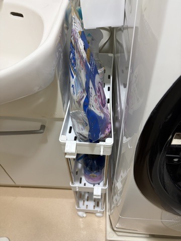
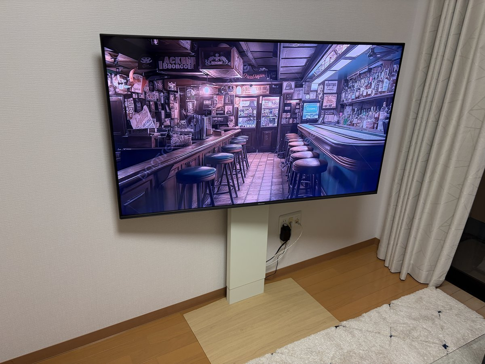

こんにちは！[@Ryo54388667](https://x.com/Ryo54388667)です！☺️

普段は都内でエンジニアとして働いています！

実は今年、結婚しまして。新居で二人暮らしが始まりました！(ちなみに婚活の話は[この記事](/ja/blogs/zakki/hitooshi-review)に書いています)

今回は **2026年上半期に買ってよかったものトップ10** を紹介していきます！

結婚を機に家具・家電・収納をほぼゼロから揃えたので、正直、人生で一番買い物をした半年でした笑

その中から「これは買って正解だった。。！」と思えたものを、10位から1位までカウントダウン形式で発表していきます！

順位は値段順ではなく、「暮らしが変わった度合い」順です。なので後半、2,000円しないのに上位に食い込んでくるやつが出てきます。

> ※この記事には、僕が実際に使っているサービスのアフィリエイト広告（PR）を含みます。紹介しているのは、すべて自費で購入して新居で使ってみて良かったものだけです。

※記載している価格は購入時・執筆時点の目安です。セールなどで変動するので、最新の価格はリンク先で確認してください🙏

## 10位: ニトリ メッシュつっぱり棚

まずはニトリの[メッシュつっぱり棚(ワイド・奥行32cm)](https://www.nitori-net.jp/ec/product/8540164/)。うちではトイレの収納に使っています。

トイレって収納がないと、ペーパーや掃除用品のストック置き場に困るんですよね。。

これを壁の間に突っ張るだけで、何もなかった空間が立派な収納になりました。工具も不要です。

うちではこの通り、ペーパーのストックと収納ボックスの定位置になっています。床に直置きしていた頃には戻れません。

価格は1,690円。この値段と思えない仕事ぶりです。

## 9位: 山崎実業 レンジフード調味料ラック

キッチン系で最初に「買ってよかった」と思ったのがこれ。山崎実業の[レンジフード調味料ラック(Plateシリーズ)](https://www.yamajitsu.co.jp/product/item/70840/)です。

レンジフードに引っ掛けるだけで、コンロの真上に調味料の定位置ができます。設置は10秒ほどで終わりました。

塩・こしょう・油が手の届く位置にあると、料理のテンポが上がります。トレイ下のフックにはお玉やフライ返しも吊るせるので、コンロ周りの作業スペースが広くなりました。

よく使う調味料と調理器具を、ぜんぶコンロの真上に集約できました。

価格は2,000〜3,000円ほど。同じ山崎実業のtowerシリーズのマグネットラックも愛用していて、着々と山崎実業沼にハマりつつあります😅

<MoshimoAffiliate id="0" />

## 8位: 日立 パワかるスティック PV-BL50L

ここで家電が登場。日立のコードレススティッククリーナー[パワかるスティック PV-BL50L(ライトゴールド)](https://kadenfan.hitachi.co.jp/clean/lineup/pv-bl50l/)です。3万円台前半で買いました。

新居の掃除機選びでは、ダイソンあたりの吸引力モンスターともさんざん迷いました。ただ、掃除機って「性能が高いか」より「サッと手に取れるか」のほうが稼働率に効くよなと思い、名前の通り軽さが売りのこれ(標準質量約1.4kg)にしました。

実はこれ、最新モデルではありません。最新型のPV-BL50Pとも迷ったのですが、差分を調べるとARおそうじアプリ対応などの高機能化がメインで、僕が重視している軽さや基本の吸引まわりは大きく変わらなさそうでした。それなら発売直後で値段の張る最新型より、こなれた型落ちで十分だなと。(この「差分が自分に効かないなら型落ちを買う」作戦、家電全般で使えるのでおすすめです)

結果は狙い通りでした。1.4kgだと片手でひょいと持ち出せるので、ホコリや髪の毛に気づいた瞬間、その場でサッと掛けられます。「よし、掃除するか」と気合を入れる工程がなくなって、**明らかに掃除の頻度が上がりました**。

週末に全部屋を一気に回るのもラクになりました。コードレスなのでコンセントの差し替えという概念がなく、自走式のヘッドが勝手に進んでくれるので、リビングから寝室まで掛けても腕が疲れません。パイプを外してハンディにすれば棚の上やソファもいけるので、結局これ1台で家中が完結しています。

ゴミ捨てもラクです。ダストケースをパカッと開けてゴミ箱の上でポン、で終わりです。

定位置はリビングの隅です。この「常に視界に入っていてすぐ手に取れる」状態が、掃除頻度を保つコツな気がしています。

ひとつ気になる点を挙げると、充電スタンドはそれなりに生活感が出ます。押し入れに隠す手もあるのですが、しまい込んだら最後、絶対に掃除しなくなる自信があったので笑、うちは動線優先で出しっぱなしにしています。インテリアを取るか、掃除のハードルを取るか。置き場所だけ先に考えておくといいと思います。

<MoshimoAffiliate id="1" />

## 7位: ekans 棚付きランドリーラック

洗面所部門の代表、ekans(エカンズ)の[棚付きランドリーラック(突っ張りタイプ・棚3段)](https://www.ekans.jp/lineup/393/)です。9,000円前後でした。

二人暮らしを始めて気づいたのですが、洗面所で使うものってめちゃくちゃ多いんですよ。妻のスキンケア用品、シャンプーや洗剤の詰め替えストック。。かさばるものだらけで、床に置き始めたら終わりの気配がありました笑

このラックがあると、洗濯機上のデッドスペースに棚を3段作れます。突っ張り式なので壁に穴を開けなくていいのもありがたいポイントです。

うちは棚に布バスケットを並べて、詰め替えストックやタオルを放り込む運用にしています。フタなしのバスケットだと出し入れが一瞬なので、ズボラな僕でも維持できています。

ホワイト×オークの見た目も気に入っています。生活感が出やすい洗面所が、整って見えるようになりました。

<MoshimoAffiliate id="2" />

## 6位: LOWYA クープ ダイニングテーブル3点セット

ここから家具です。LOWYAの[クープ ダイニングテーブル3点セット(幅90)](https://www.low-ya.com/goods/S_S200048)。テーブルとチェア2脚のセットで、3万円台前半でした。

決め手は円形のテーブルであること。角がないので狭めのダイニングでも動線を邪魔しないし、向かい合って食事するときの距離感もほどよいんです。

丸テーブルにして正解でした。圧迫感がなくて、狭めのスペースでも窮屈に見えません。

天然木の質感も価格以上に見えます。組み立ては拍子抜けするほど簡単でした。

二人暮らしのダイニングに何を置くか迷っている方には、まず候補に入れてほしいセットです。

<MoshimoAffiliate id="3" />

## 5位: LOWYA オノマ 2人掛けソファ

ここからはベスト5、わが家の主力たちです。

LOWYAの[オノマ 2人掛けソファ(幅156・天然木脚)](https://www.low-ya.com/goods/F201_G1003)。36,000円ほどでした。

コーデュロイ調の生地の質感が良くて、部屋に置いた瞬間「お、なんかそれっぽい部屋になったな」と思いました笑

実物がこちら。うちはモカを選びました。落ち着いた色味で、木の家具が多いわが家にもすっとなじんでいます。

幅156cmで、二人でゆったり座れるサイズ感。天然木脚の北欧風デザインなので、先ほどのダイニングセットともテイストが揃います。

1点だけ注意があるとすれば、本体が36kgほどあって搬入と開梱はなかなかの力仕事です。二人での作業をおすすめします。

<MoshimoAffiliate id="4" />

## 4位: RASIK キッチンボード「リオラ」

RASIKの[ゴミ箱上ラック・キッチンボード「Liora リオラ」(幅90cm・グレージュ)](https://rasik.style/products/215023-90-gg)です。29,980円でした。

ゴミ箱の上の空間に、電子レンジ・炊飯器・食器・ゴミ箱をまとめて収納できる2in1の家具です。コンセント付きなので、家電の電源問題も起きません。

スチール×木目のグレージュの見た目が良くて、キッチンなのに高級感があります。二人分の食器も扉の中にすっぽり収まりました。

うちではトースターやケトルを置いて、下の段にゴミ箱を2つ収めています。家電・食器・ゴミ箱の置き場が、この1台で完結しました。

そして白状すると、これは自分で組み立てていません。

説明書を見た時点で「これは休日が溶けるやつだ。。」と悟り、くらしのマーケットで組み立てを依頼しました。結果、大満足の仕上がり。大型家具の組み立てに自信のない人は、素直にプロに頼むのがおすすめです。

<MoshimoAffiliate id="5" />

## 3位: 東洋プラン スリムワゴン(幅12.5cm)

3位はダークホース。東洋プランの[キャスター付きスリムワゴン(幅12.5cm・3段)](https://www.amazon.co.jp/dp/B0GC7L3CDW)です。1,880円。

洗面所の洗濯機横に、幅十数cmの微妙な隙間があったんです。「ここはもう何も置けんやろ」と諦めていた場所でした。

そこにこれがピッタリ収まったときは、想像以上に感動しました。キャスター付きなので、引き出せば奥のものも取れるし掃除もできる。組み立ても簡単でした。

この収まり具合です。洗面台と洗濯機の間の数cmが、洗剤の詰め替えストックの定位置になりました。

この買い物から学んだ教訓があります。**根気強く探せば、その隙間に合う収納用品はだいたい存在する。**

「うちのあの隙間は無理だしな。。」と思っている方、諦めるのはまだ早いです！

<MoshimoAffiliate id="6" />

## 2位: WALL 壁寄せテレビスタンド V3

2位はWALLの[壁寄せテレビスタンド V3(左右首振りタイプ・LOW・ホワイトオーク)](https://equals.tokyo/c/wall_tv_stand/v3sw_low)。本体は39,900円です。

テレビ台を置かずに、壁掛け風にテレビを立てられるスタンドです。工事不要なのに壁掛けのようなすっきり感が出て、リビングが広く見えます。

左右に首を振れるのも思った以上に便利で、ソファからでもダイニングからでも見やすい角度に調整できます。配線も背面のパネルに隠せるので、テレビ周りのコードごちゃごちゃが消えました。

設置後のリビングの写真は、このあとの1位でまとめてお見せします！

オプションのマルチデバイスホルダーとマグネット付き電源タップも追加しましたが、どちらも活躍しています。

そして声を大にして言いたいのが、組立設置サービス(4,950円)にお金を払う価値です。

開封から組み立て、テレビの取り付け、配線までテキパキと進めてくれて、仕上がりもきれい。テレビという大物を自分で持ち上げて金具に固定する不安がなくなるだけでも、この値段は安いと思いました。

<MoshimoAffiliate id="7" />

## 1位: ハイセンス 55V型 4K液晶テレビ 55E7N 🎉

栄えある1位は、ハイセンスの[55V型 4K液晶テレビ 55E7N(Amazon限定・3年保証モデル)](https://www.amazon.co.jp/dp/B0DCFPWDK5)です！

2位のWALLスタンドとセットで、わが家のリビングはこうなりました。テレビ台なしのこの佇まい、リビングで一番のお気に入りです。

選んだ理由はスポーツです。大画面でスポーツを見たくて、動きの速い映像に耐えられる倍速パネル(ゲームモード時は144Hz VRR対応)のモデルを探していました。

結果は大正解。スポーツの速い展開もぬるぬる映るし、量子ドットの発色は「この価格でこの画質でいいんですか？？」というレベルです。

YouTubeやNetflixなどのネット動画もリモコン一発でサクサク。ゲームをつないでも快適です。

発売時は13万円超だったモデルですが、セールのタイミングを狙って8万円台で買えました。**画質・ゲーム・ネット動画が全部入りでこの価格は、正直ちょっとおかしい**と思っています笑

一つだけ気になる点も書いておくと、口コミの通り音の厚みは物足りない気はします。スピーカーの構成的に仕方ない部分ですが、自分は全く気にならない程度でした。気になる人はサウンドバーを足せば解決すると思います。

Amazon限定モデルは3年保証付きなのも、テレビという長く使う家電では安心材料でした。

いまは週末に5位のソファへ沈み込んで、この大画面でスポーツを見る時間が、新生活でいちばんの楽しみになっています。

<MoshimoAffiliate id="8" />

## 最後に

2026年上半期に買ってよかったものトップ10でした！改めて一覧にします。

1. ハイセンス 55V型 4K液晶テレビ 55E7N
2. WALL 壁寄せテレビスタンド V3
3. 東洋プラン スリムワゴン(幅12.5cm)
4. RASIK キッチンボード「リオラ」
5. LOWYA オノマ 2人掛けソファ
6. LOWYA クープ ダイニングテーブル3点セット
7. ekans 棚付きランドリーラック
8. 日立 パワかるスティック PV-BL50L
9. 山崎実業 レンジフード調味料ラック
10. ニトリ メッシュつっぱり棚

こうして並べると、リビング・キッチン・洗面所と家中まんべんなく買っていますね。。新生活、恐るべし。

これから新婚生活や二人暮らしを始める方の参考になればうれしいです！

ちなみに新生活つながりで、夫婦の家計管理の話も[この記事](/ja/blogs/zakki/saikyo-kakei-system)に書いています。よければどうぞ！

下半期もいい買い物ができたら、また書きます。(正直、失敗した買い物もいくつかあるので、そっちの記事が先になるかもしれません。。)

最後まで読んでいただきありがとうございます！

気ままにつぶやいているので、気軽にフォローをお願いします！🥺
