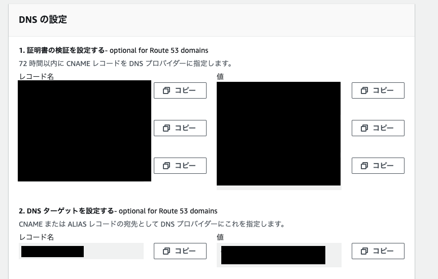

こんにちは！[@Ryo54388667](https://x.com/Ryo54388667)です!☺️

<br />

普段は都内でエンジニアとして業務をしてます！

主にTypeScriptやNext.jsといった技術を触っています。

今回はTerraformでApp RunnerのDNSターゲットをRoute53のAレコードに設定する方法を紹介していきます！

<br />

## 行いたいこと

App Runnerはデフォルトドメインを発行してくれるので、デプロイさえ終えれば自動的にWeb上に公開することができます！ドチャクソ便利ですよね！ただ、デフォルトではなくカスタムドメインを利用したいケースがほとんどだと思います。もちろん、App Runnerにはカスタムドメイン機能もサポートしています。

[https://aws.amazon.com/jp/apprunner/](https://aws.amazon.com/jp/apprunner/)

<br />

<br />

画像のような値を対象のレコードに設定すればカスタムドメインを設定できます。



<br />

このレコードの設定に関して、もちろんAWS マネジメントコンソール上で設定することもできますが、IaCを利用する事例も増えているように感じますので、今回はIaCの一つであるTerraformを利用して設定していきます。

<br />

**前提条件**

- AWS CLIの設定済み
- Terraformの環境構築済み
- Route53のホストゾーンの設定済み

<br />

## 実装について

先ほどの画像の「証明書の検証」(1.の箇所)をCNAMEを設定します。

```hcl title="route53.tf"
resource "aws_route53_record" "cname_validation_a" {
  name    = var.cert_validation_record_name_a
  zone_id = aws_route53_zone.main_prd.zone_id
  type    = "CNAME"
  ttl     = 300
  records = [var.cert_validation_record_value_a]

  depends_on = [aws_apprunner_service.apprunner]
}
resource "aws_route53_record" "cname_validation_b" {
  name    = var.cert_validation_record_name_b
  zone_id = aws_route53_zone.main_prd.zone_id
  type    = "CNAME"
  ttl     = 300
  records = [var.cert_validation_record_value_b]

  depends_on = [aws_apprunner_service.apprunner]
}
resource "aws_route53_record" "cname_validation_c" {
  name    = var.cert_validation_record_name_c
  zone_id = aws_route53_zone.main_prd.zone_id
  type    = "CNAME"
  ttl     = 300
  records = [var.cert_validation_record_value_c]

  depends_on = [aws_apprunner_service.apprunner]
}
```

CNAMEレコードの設定は特段問題なく設定できると思います。

いくつかつまづきポイントがあるのは「DNSターゲットを設定する(2.の箇所)」です。

<br />

僕はこのDNSターゲットの箇所でつまずきました😇はじめは、「ここも同様にCNAMEレコードで登録すればええんやろー」と思っていたのですが、下記のエラーが出ました。。

```plaintext
 Error: creating Route 53 Record: InvalidChangeBatch: [RRSet of type CNAME with DNS name <ドメイン名> is not permitted at apex in zone <ドメイン名>]
```

このエラーはCNAMEの仕様上、同様のドメイン名のNSレコードが存在する場合、同一ゾーンには共存できないらしいです。。

<br />

[https://blog.serverworks.co.jp/dns-cname-record-error](https://blog.serverworks.co.jp/dns-cname-record-error)

<br />

僕は外部のドメインサービスを利用するために、同様の名前のNSレコードを設定していました。このため、エラーが起きました。

DNSターゲットはAレコードでも設定できるので、CNAMEではなく、その方法で設定していきます。多くの記事では下記のようなexampleで書かれています。

```hcl
//例
resource "aws_route53_record" "www" {
  zone_id = aws_route53_zone.primary.zone_id
  name    = "example.com"
  type    = "A"

  alias {
    name                   = aws_elb.main.dns_name
    zone_id                = aws_elb.main.zone_id
    evaluate_target_health = true
  }
}
```

<br />

ここでzone\_idが２つあることがわかります。２つ目のzone\_idはdnsが存在するゾーンのidを表しています。今回、App Runnerで言えば、App Runnerのデフォルトドメインが存在するホストゾーンのidを設定する必要があります。とはいえ、「そんなものわかるんか。。」と思ったのですが、ありがたいことに公開されていました👏詳しくは下記のURL。

[https://docs.aws.amazon.com/general/latest/gr/apprunner.html](https://docs.aws.amazon.com/general/latest/gr/apprunner.html)

> 2024/06/15現在
>
> ap-northeast-1の場合、Z08491812XW6IPYLR6CCA

<br />

それを踏まえて、下記のようにAレコードを設定しました。

```hcl title="route53.tf"
resource "aws_route53_record" "dns_a_record" {
  name    = var.dns_record_name
  zone_id = aws_route53_zone.main_prd.zone_id
  type    = "A"

  alias {
    name = var.dns_record_value
    # NOTE: 参照 https://docs.aws.amazon.com/general/latest/gr/apprunner.html
    zone_id                = "Z08491812XW6IPYLR6CCA"
    evaluate_target_health = false
  }

  depends_on = [aws_apprunner_service.apprunner]
}
```

<br />

<br />

より良い方法があれば教えてください〜

最後まで読んでいただきありがとうございます！

気ままにつぶやいているので、気軽にフォローをお願いします！🥺

<br />

<Tweet id="1793968643367387568" url="https://twitter.com/Ryo54388667/status/1793968643367387568" />

<br />

<br />
