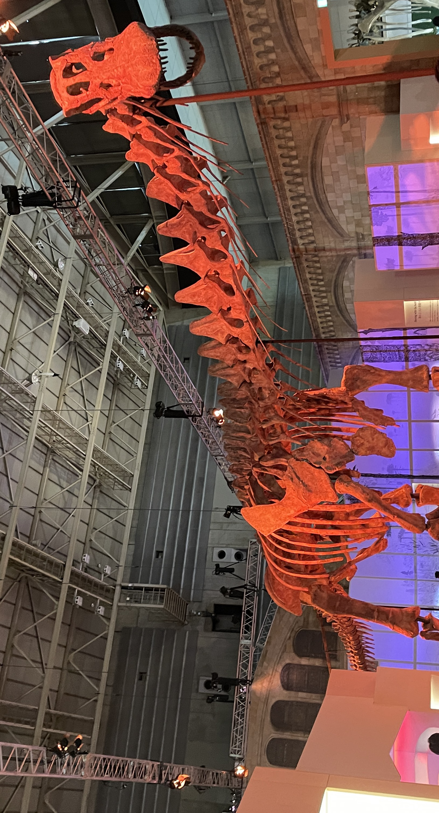

 

こんにちは！[@Ryo54388667](https://x.com/Ryo54388667)です!😆

普段は都内でエンジニアとして業務をしてます！

主にTypeScriptやNext.jsといった技術を触っています。

横浜で開催されている巨大恐竜2024に行ってきたので感想をポツポツ書いていきます！雑談なので有益なことは全くありません。。

 

## はじめに

 

横浜で開催されている巨大恐竜2024に行ってきました！

パタゴティタンなどの超巨大な恐竜に焦点を当てた展示です。ド迫力の化石ばかりで童心をくすぐられます！印象に残った箇所を書いていきます。

 

## 効率的な肺

 

恐竜が巨大化する要因の一つに**効率的な肺**が備わっていることが挙げられるそうです。

「効率的な肺ってなんぞ。。」

と思ったので、翌日に調べてみました！

 

現代の鳥類と同じような器官を持っていたと言われています。恐竜が祖先だからか。

それは、**気嚢（きのう）という呼吸器官&#x3000;**&#x3060;そうです！これは哺乳類の肺にはありません。どの点が効率的かというと、息を吸う時も、吐く時も常に肺に新鮮な空気を取り込める点です。気嚢という器官に一時的に新鮮な空気を保管し、息を吐くときに肺に送り込むので、肺に絶えず新鮮な空気が存在する状態になるそうです。気嚢もすごいですが、逆流を防ぐための弁も高機能だなーと感じました。

 

詳しくは下記のページが参考になりました！

[https://natgeo.nikkeibp.co.jp/nng/article/news/14/2167/](https://natgeo.nikkeibp.co.jp/nng/article/news/14/2167/)

 

 

## ChatGPTと会話しながら博物館を楽しみたいけど、通話禁止と書かれている。。

 

今回、ChatGPTとやりとりしながら展示を楽しみたかったのですが、施設内には「通話禁止」の文字があったのでやめておきました。

他の人の意見もお聞きしたいところではあります。

 

片耳にAir Podsをつっこんで、ChatGPTアプリと会話しながら展示を見ている風体を想像すると、他者から見ると通話しているように見えます。自分としては通話をしているわけではないのですが、他者から見ると通話をしているようにしか見えません。

 

博物館でスマホの通話が禁止されている明確な理由は見つかりませんでした。あくまで、マナーの範囲なのでしょう。

 

今回はChatGPTを利用して、テキストでぽちぽち調査をしながら展示を見ていました。博物館の体験向上とマナーとのバランスは難しいと感じます。ChatGPTによる解説を許可してしまうと、専用のオーディオ解説コンテンツが売れなくなるので、運営側としては許可する動機はありません。現状はChatGPTのテキストによる調査が折衷案ですかねー。

 

 

 

いろいろ思うことはありましたが、非常に面白い展示でした！

恐竜好きの人はぜひ！

 
