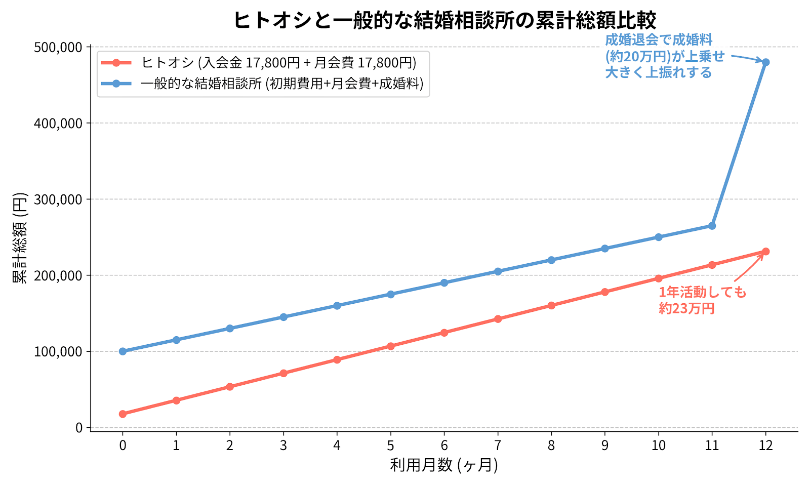

Hello! I'm [@Ryo54388667](https://x.com/Ryo54388667)!☺️

 

This time, I'm going to break down the pricing of the marriage-hunting service "Hitooshi" — the fee structure, a total-cost simulation, and how it compares to other services!

 

Whenever I sign up for anything, I'm the type who can't rest until I've laid out "so, how much will this actually cost me in total?" in a spreadsheet😅 Marriage-hunting services are exactly the same: if you only look at the monthly fee when you sign up, you tend to end up thinking "wait, I'm paying more than I expected…"

 

If you searched something like "Is Hitooshi expensive?" or "What's the total of the enrollment and monthly fees?" and landed here, I've organized everything on a numbers basis so that by the time you finish reading, you can state your total cost with confidence.

 

## Hitooshi's Pricing in 30 Seconds (Quick Reference)

Before the details, let me put the conclusion up front. This is all you really need to know.

> **Hitooshi costs 17,800 yen to enroll plus 17,800 yen per month (tax included).** There's no meeting fee and no success fee, and the minimum usage period is 3 months. If you stay active for a full year, the total comes to about 231,400 yen.

| Item                 | Amount (tax incl.)                              |
| -------------------- | ----------------------------------------------- |
| Enrollment fee       | 17,800 yen (5,000 yen off with a referral code) |
| Monthly fee          | 17,800 yen                                      |
| Meeting fee          | 0 yen                                           |
| Success fee          | 0 yen                                           |
| Minimum usage period | 3 months                                        |

\*As of May 2026. Pricing and campaigns may change, so please check the latest details on the [official Hitooshi website](https://hito-oshi.com/).

> ⚠️ **The one thing to watch out for is the "3-month minimum usage period."** If you cancel within 3 months, a cancellation fee (up to 20,000 yen) applies. I'll explain this in detail in the "fee breakdown" section below.

The key point is that **both the meeting fee and the success fee are 0 yen**. Traditional marriage agencies tend to have a strong "pay 200,000–300,000 yen as a success fee when you get married" image, so a 0-yen success fee is fairly rare.

## What Exactly Is Hitooshi?

Before we get into pricing, let me set the stage a bit.

Hitooshi is an online-completed marriage-hunting service where a professional "matching planner" introduces you to two compatible partners each month. As the name suggests ("hitooshi" means "a strong recommendation"), the concept is that your dedicated planner champions you and pushes you forward to other members.

Here are the key points:

- No profile writing or message exchanges needed: the planner introduces you to partners
- Fully online: everything from the roughly 45-minute interview (Zoom) to the first meeting is online
- Two introductions per month + refund guarantee: if they can't introduce two people after your interview, you get a full refund (per the official site)
- Screening required: a certificate of singleness is mandatory, and there's screening on education, income, occupation, etc.
- Service areas: Kanto, Kansai, and Tokai (areas may change, so check the official site)

It's easiest to think of Hitooshi as sitting right in the middle: a higher level of "seriousness" than matching apps, but a lower barrier in terms of "ease" and "price" than a traditional marriage agency!

> There are also points of preference that divide opinion, such as the fact that you can't see your partner's photo until the day of the meeting. I've written about these experiences in my [review article](/en/blogs/zakki/hitooshi-review), so check it out if you're curious!

## Breaking Down the Fees One by One

Even when told "it's just the enrollment fee and the monthly fee," you can't help but doubt whether that's really all (I did💦). Let me verify each item based on primary sources.

### Enrollment Fee: 17,800 Yen (5,000 Yen Off with a Referral Code)

The enrollment fee of 17,800 yen is charged just once when you sign up.

At a typical marriage agency, the enrollment fee + registration fee + initial activity costs often add up to **100,000–180,000 yen**, so this is quite modest. And as I'll cover later, **using a referral code knocks 5,000 yen off this**.

### Monthly Fee: 17,800 Yen (tax incl.)

The 17,800 yen monthly fee is what you pay every month. You won't be charged extra based on the number of meetings or introductions.

### Meeting Fee & Success Fee: 0 Yen

This is the tastiest part of Hitooshi's pricing!!☺️

At marriage agencies, some charge a "meeting fee" of 5,000–10,000 yen per meeting, and a "success fee" of 200,000–300,000 yen when you leave upon getting married.

Hitooshi has **0 yen for both the meeting fee and the success fee**. Not having the worry of "a huge bill waiting when I reach the finish line" is mentally a lot easier, I think. Especially for younger people, the peace of mind of a 0-yen success fee really matters!

### Minimum Usage Period: 3 Months (Cancelling Within 3 Months Incurs a Cancellation Fee)

The one constraint is the "3-month minimum usage period." So it's best to plan on at least the **enrollment fee + 3 months of monthly fees**.

And this is something you really want to understand before signing up: **if you cancel partway through the minimum usage period (3 months), a "cancellation fee" applies.** The official [terms of service](https://hito-oshi.com/rule/) (Article 5) state the following:

> Amount due on mid-term cancellation = the value of services already provided + a cancellation fee
>
> Cancellation fee = **20,000 yen (tax incl.)** or **20% of the monthly fees for the remaining period**, **whichever is lower**

For example, the terms include a calculation example: if you cancel on day 20 of a monthly plan, it's calculated as "2 months remaining," and 20% of those monthly fees becomes the cancellation fee. So it's not suited to a "just try it for a month and quit right away if it doesn't fit" approach⚠️

By the way, I've documented what actually withdrawing looks like (the LINE exchange, how long it took, whether they pressure you to stay) with screenshots in [my article on withdrawing from Hitooshi](/en/blogs/zakki/hitooshi-withdrawal).

On a more granular note, the terms also set out cancellation fees of **5,000 yen for cancelling an initial interview at the last minute (from 2 days before to the day of)** and **2,000 yen per instance for last-minute cancellation or no-show at a meeting**. These won't matter as long as you don't cancel at the last minute, but keep them in the back of your mind.

On the flip side, there's also a nice rule: on the 6-month and 12-month plans, if you "leave because a relationship developed with someone Hitooshi introduced," 100% of the monthly fees for the remaining period are refunded🎉

Since marriage-hunting rarely produces results in a single month, I recommend signing up on the premise that you'll be active for at least 3 months.

## Total-Cost Simulation: How Much for 3, 6, and 12 Months?

Here's the main event. I calculated how the total comes out when you apply the "enrollment fee + monthly fee" to actual activity periods.

The formula is simply **17,800 yen enrollment + (17,800 yen monthly × number of months)**. Very simple.

| Usage period       | Formula              | Total (tax incl.) |
| ------------------ | -------------------- | ----------------- |
| 3 months (minimum) | 17,800 + (17,800×3)  | **71,200 yen**    |
| 6 months           | 17,800 + (17,800×6)  | **124,600 yen**   |
| 12 months          | 17,800 + (17,800×12) | **231,400 yen**   |

And here's how it looks **when the enrollment fee is reduced by 5,000 yen with a referral code**:

| Usage period | Normal total | With referral code |
| ------------ | ------------ | ------------------ |
| 3 months     | 71,200 yen   | **66,200 yen**     |
| 6 months     | 124,600 yen  | **119,600 yen**    |
| 12 months    | 231,400 yen  | **226,400 yen**    |

What I want you to notice is that **even a full year of activity comes to about 230,000 yen**. Broken down per month, that's **effectively a little over 19,000 yen**. As I'll discuss below, a typical marriage agency can charge 200,000–300,000 yen for the success fee "alone," so the image is "a full year of Hitooshi costs about the same as a single success fee at a marriage agency."

## Thinking About "Is Hitooshi Expensive?" by Comparing It to Matching Apps and Marriage Agencies

Reading this far, some of you may feel "hold on, isn't 17,800 yen a month quite a bit pricier than a matching app?" I totally get that feeling.

So I lined up the three options — **matching apps, Hitooshi, and marriage agencies** — on the same criteria.

> ⚠️ The amounts in the table below vary greatly by plan and location. These are "typical ballpark figures" only and don't refer to any specific company. Please check each service's official information for exact amounts.

|                 | Matching app              | Hitooshi                              | Marriage agency (intermediary)        |
| -------------------- | ------------------------- | ------------------------------------- | ------------------------------------- |
| Monthly fee (guide)  | approx. 3,000–4,500 yen   | 17,800 yen                            | 10,000–16,000 yen                     |
| Initial cost         | almost 0 yen              | 17,800 yen                            | 100,000–180,000 yen                   |
| Success fee          | 0 yen                     | **0 yen**                             | 200,000–300,000 yen                   |
| Finding a partner    | **you do it yourself**    | **the planner introduces**            | counselor + search                    |
| Seriousness          | varies by person          | high (screening, proof of singleness) | high (screening, proof of singleness) |
| 1-year total (guide) | approx. 40,000–50,000 yen | **approx. 230,000 yen**               | **approx. 450,000–600,000 yen**       |

Lining them up like this makes Hitooshi's position clear.

- **It's more expensive than a matching app** — that's a fact. But with apps, all the effort of "searching, messaging, and vetting" is on you. Hitooshi has the planner handle that for you, so the image is that **you're buying time with money**.
- **It's significantly cheaper than a marriage agency.** The 0-yen success fee especially helps, and it's not unusual for the one-year total to come to less than half.

In other words, "expensive or cheap" isn't decided in isolation — my conclusion is that the evaluation changes based on **how much of the searching effort and seriousness you want to buy with money**. It fits well as the service people consider next after getting worn out by apps!

## How to Make Hitooshi Cheaper

Even with the same fee structure, your "real cost-effectiveness" changes depending on how you sign up and how you use it.

### Use a Referral Code to Get 5,000 Yen Off the Enrollment Fee

This is the most reliable one. If you enroll using an existing member's referral code, you get 5,000 yen off the 17,800 yen enrollment fee (and the person who referred you also gets a perk).

5,000 yen is about enough for a first-date cafe bill plus a little extra, after all. If you'd like, please feel free to use my referral code☺️

▼Apply here!!

[https://hito-oshi.com/?ref=shoukai-app](https://hito-oshi.com/?ref=shoukai-app)

When you enroll, registering as a new member with the invitation code below gets you 5,000 yen off the enrollment fee!

1. Apply for membership from the official website or official LINE
2. When applying, select "Introduced by an acquaintance" for the "How did you hear about Hitooshi?" option
3. Enter the following invitation code in the input field

▼Invitation Code

<Copyable>A2R7FE3K</Copyable>

Please give it a try!

## Conclusion: Hitooshi's Pricing Makes Sense When You Look at the Total

I've organized Hitooshi's pricing on a numbers basis. Here are the key takeaways!

- Hitooshi's pricing is a simple structure: 17,800 yen enrollment + 17,800 yen monthly, with a 0-yen success fee
- Total-cost simulation: 71,200 yen for 3 months / 124,600 yen for 6 months / 231,400 yen for 12 months (effectively just under 20,000 yen a month)
- A referral code gets you 5,000 yen off the enrollment fee, so there's no reason not to use one
- It's pricier than a matching app, but with a 0-yen success fee, the total is far cheaper than a marriage agency (typically 450,000–600,000 yen)
- The only constraint is the "3-month minimum usage period"; just note that cancelling within 3 months incurs a cancellation fee (up to 20,000 yen)
- With two introductions a month, the risk of "zero encounters" is low

Even if you feel "the enrollment and monthly fees are both kind of pricey…," the right call is to compare marriage-hunting by total cost, not monthly fee. Looking at it that way, I felt Hitooshi's pricing design is quite reasonable.

If you're interested, first check the latest pricing and campaigns via a free consultation, and don't forget to use the **5,000-yen referral discount**!

▼Apply here!!

[https://hito-oshi.com/?ref=shoukai-app](https://hito-oshi.com/?ref=shoukai-app)

When you apply, select "Introduced by an acquaintance" and enter the invitation code to get 5,000 yen off the enrollment fee.

▼Invitation Code

<Copyable>A2R7FE3K</Copyable>

Please give it a try!

I've covered the service's content and my actual impressions in detail in my [Hitooshi review article](/en/blogs/zakki/hitooshi-review), so please read it alongside this before applying☺️

## Primary Sources Referenced 🔍

The pricing information in this article is based on the following primary and official sources (as of May 2026). Pricing and campaigns may change, so please always check the latest official information before signing a contract.

- [Official Hitooshi website](https://hito-oshi.com/) (pricing, service details, service areas)
- [Notation based on the Act on Specified Commercial Transactions | Hitooshi](https://hito-oshi.com/law/) (operator and official fee notation)
- [Terms of Service | Hitooshi](https://hito-oshi.com/rule/) (cancellation fee and minimum usage period)
- [Official Hitooshi X (@hitooshi\_1104)](https://x.com/hitooshi_1104) (latest campaign information)

 

Thank you for reading to the end!

I tweet casually, so please feel free to follow me!🥺

[@Ryo54388667](https://x.com/Ryo54388667)
