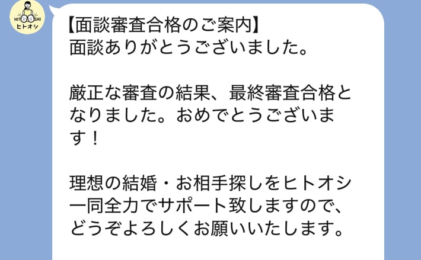

Hi! I'm [@Ryo54388667](https://x.com/Ryo54388667)!☺️

 

If you're about to apply to the Japanese matchmaking service Hitooshi and just remembered "wait, there's a screening process..", this article is for you.

I was in the same boat before applying — worried I might not pass. Spoiler: even I, who can hardly be called high-spec, got in.

 

In this article, I'll walk through **what's officially confirmed about the screening**, fact-check the acceptance-rate rumors, and share tips to improve your chances — all from the perspective of a user who actually went through it.

If you're new to Hitooshi itself, start with [my overview article on how it works and who it suits](/en/blogs/zakki/hitooshi-konkatsu) to get the full picture first.

## How the Screening Works: Documents Plus an Interview

Let's start with the structure. Hitooshi's official "Safety Initiatives" page states it clearly.

> In addition to document-based screening, Hitooshi also conducts an interview-based screening. A matching planner confirms through the interview whether you genuinely intend to pursue marriage.
>
> ([Safety Initiatives | Hitooshi](https://hito-oshi.com/safe/), translated from Japanese)

The flow looks like this:

1. Apply via the official website or official LINE account
2. Fill in the pre-interview questionnaire and submit documents (photo ID + singlehood pledge)
3. Initial interview with a matching planner (Zoom)
4. Screening
5. Result notification

So submitting documents isn't the end of it — the initial interview is part of the screening too.

For what you'll be asked in the interview, required documents, and how to prepare, see [my article on the initial interview](/en/blogs/zakki/hitooshi-interview)!

 

As for the result: in my case, this notification arrived via the official LINE account.

As you can see from the wording "you have passed the final screening," it's officially called the "final screening."

Hitooshi doesn't publish how long results take. However, Hitooshi's COO Mr. Shimizu (product manager at the time), who tried his own company's service, describes in [his note article](https://note.com/shintaro_shimizu/n/n2a1f2185c81a) how the "screening passed!!" notice arrived shortly after his initial interview. It doesn't seem to be the kind of screening that leaves you hanging for weeks.

## The Screening Items Are Actually Disclosed by Hitooshi

People assume the screening is a total black box, but what gets checked is written in the official FAQ.

> You will enter the required items (education, income, occupation, face photo, and a short comment), and our staff visually reviews all of them.
>
> (From the FAQ on the [official Hitooshi website](https://hito-oshi.com/), translated from Japanese)

The [Terms of Service](https://hito-oshi.com/rule/), Article 3, also lists the eligibility requirements. In summary:

| Requirement | Details |
| --- | --- |
| Single | No spouse or common-law partner |
| No current partner | You can't join while in a relationship |
| Age | Men 20–45, women 20–39 |
| Location | Living within the service area (17 prefectures across Kanto, Kansai, and Tokai) |
| Documents | Able to submit a photo ID and the singlehood pledge |

*The service area is as of July 2026. It has been expanding, so check the [official website](https://hito-oshi.com/) for the latest coverage.*

All of the above is confirmed. But when it comes to *how* you're evaluated, the Terms are explicit:

> We cannot answer any questions about the screening method, criteria, or the reasons for screening results.
>
> ([Terms of Service | Hitooshi](https://hito-oshi.com/rule/), Article 3, translated from Japanese)

In other words, most of the "here are Hitooshi's screening criteria!" articles out there are either paraphrases of the FAQ above or the writer's guesswork. Nobody outside the company knows the actual evaluation criteria.

## Fact-Checking the Acceptance Rate: Where "10%" Comes From

The obvious next question is the acceptance rate. Here's the thing: **Hitooshi has never published an acceptance rate for member screening**. There are no numbers in the FAQ or the Terms.

Still, if you search around, you'll find figures like "10%" and "30–50%."

 

If "10%" scared you — relax. Trace it back and you arrive at a [note article](https://note.com/matchingstory/n/n74dcc610a640) written in 2020 by founder Saki Ito. The 10% there refers not to member screening, but to the **hiring rate for matching planners (staff)**.

A staff-hiring figure has taken on a life of its own as a member acceptance rate.. that seems to be what happened. As for "30–50%," I couldn't find any article with a verifiable source.

 

Instead of dubious numbers, here's one solid fact: even if you don't pass, the official FAQ says you can reapply after leaving an interval of three months or more. It's not a one-shot game.

## For the Record, I Passed with These Specs

Now for a real example. My specs at the time of screening, as written in [my hands-on review](/en/blogs/zakki/hitooshi-review):

> Face: (please don't ask…)
>
> Age: late 20s
>
> Height: upper 160s cm
>
> Income: middling
>
> (From [my Hitooshi review article](/en/blogs/zakki/hitooshi-review))

Copying this out again is making me sad.. but this passed the final screening. I also received my two introductions per month as normal, so it's by no means a "high-spec only" gate.

 

That said, passing doesn't mean everyone gets identical conditions. One user's account on note reports being told during the interview that "the number of people we can introduce will be quite limited" ([a note post by an average-looking Hitooshi user](https://note.com/denshrine/n/n774d4de037ab), translated from Japanese).

The Terms of Service also include a provision (Article 9) allowing the company to terminate the contract when introductions are unfeasible because a member doesn't meet what other members are looking for. So it's natural to read the screening as not just "can you get in," but also **an assessment of whether introductions are likely to work for you**.

## What the Screening Is Really For, According to the Founders

The criteria are private, but you can infer what the screening is *for* from what the executives have said publicly.

Founder Saki Ito put it bluntly on X: the singlehood pledge and the screening are there to "shut out people who are just looking for hookups" (from a May 2021 post by [@matchappsaki](https://x.com/matchappsaki), translated from Japanese).

The same Mr. Shimizu wrote this in his article about experiencing the initial interview itself:

> The people who can clearly put their ideal partner and married life into words tend to find a partner quickly and graduate from Hitooshi.
>
> ([I Tried My Own Company's Service "Hitooshi" — the Initial Interview](https://note.com/shintaro_shimizu/n/n5df0a89db51c), translated from Japanese)

What emerges from these statements is that the screening isn't a spec-based selection exam. It's a check on two things: "can we keep the community safe?" and "will the introduction system actually work for this person?"

It's not a competition of degrees and salaries, so don't be intimidated. I mean — I got in..

## Four Tips to Improve Your Chances

Based on the official information and my own experience, here are the four things worth doing.

### 1. Don't Embellish in the Interview — Getting Stuck Is Fine

Mr. Shimizu's note article includes this line from the matching planner who ran his interview:

> Stumbling a little on an answer here does NOT mean instant rejection, so if you're taking the initial interview, don't worry!
>
> (A matching planner quoted in the same note article, translated from Japanese)

The interview is less an exam and more a working session to set the direction of your introductions. If you pass by playing a polished version of yourself, the introductions proceed based on that persona and you end up with mismatches — being your unvarnished self pays off in the end.

### 2. Put Your Thoughts into Words Before the Questionnaire

That "people who can put it into words graduate quickly" quote converts directly into a tip.

Before the interview, jot down — even roughly — your ideal partner, the married life you want, and your non-negotiables. It sharpens the interview and naturally conveys how serious you are about marriage.

### 3. Go All-In on a Bright, Clean-Looking Photo

Of the five visually reviewed items, the one that makes an instant impression is the face photo.

Rather than perfecting a posed selfie, a clean, friendly photo taken in good lighting is the safer bet. Standard matchmaking-photo wisdom applies as-is.

### 4. Don't Over-Narrow Your Preferences

As covered earlier, the screening likely includes an assessment of whether introductions can actually happen.

If you lock your preferences down too tightly, you create room for the judgment that there's no one to introduce — i.e., the service can't function for you. Splitting your conditions into "absolute must-haves" and "nice-to-haves" is the way to go.

## Closing Thoughts

To sum up Hitooshi's screening:

- It's a two-stage process (documents + interview), and the result arrives via the official LINE account
- The reviewed items (education, income, occupation, photo, short comment) are officially disclosed, but the evaluation criteria themselves are private
- The rumored "10% acceptance rate" is a staff-hiring figure that took on a life of its own
- You don't need to be high-spec to pass (exhibit A: me)
- Even if you don't pass, you can reapply after three months

If the screening is what's holding you back, the fastest move is to just proceed to the free initial interview. It costs nothing, so there's nothing to lose by trying.

Curious what the members are like? See [my article on member profiles](/en/blogs/zakki/hitooshi-members). For costs after joining, see [the pricing article](/en/blogs/zakki/hitooshi-price).

 

If you do decide to join, using a referral code gets you 5,000 yen off the enrollment fee. Feel free to use mine☺️

1. Apply via the official website or official LINE account
2. When asked "How did you hear about Hitooshi?", select "referral from an acquaintance"
3. Enter the invitation code below

Referral code: <Copyable>A2R7FE3K</Copyable>

▼Join here

[https://hito-oshi.com/?ref=shoukai-app](https://hito-oshi.com/?ref=shoukai-app)

 

Thank you for reading to the end!

I tweet casually about tech and life, so feel free to follow me!🥺

[@Ryo54388667](https://x.com/Ryo54388667)
