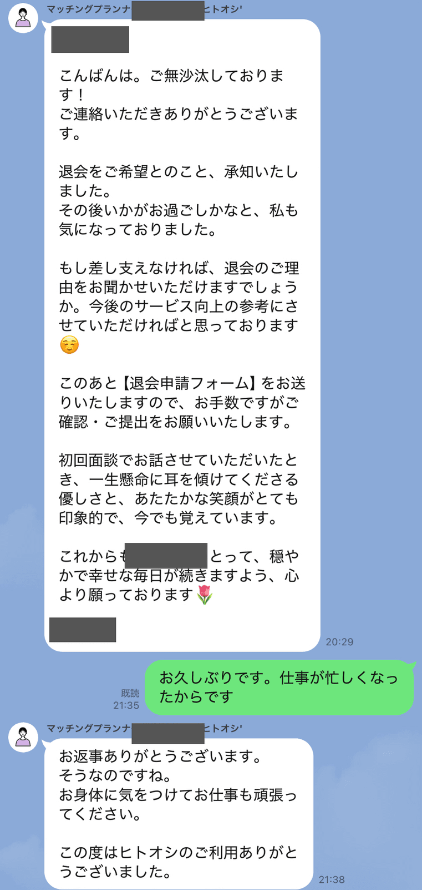
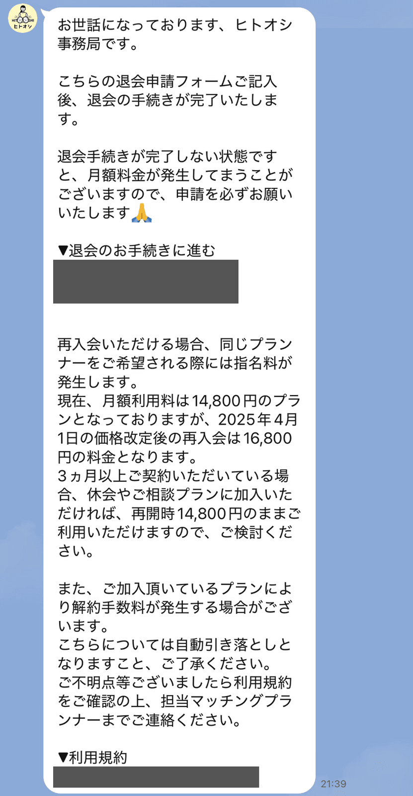
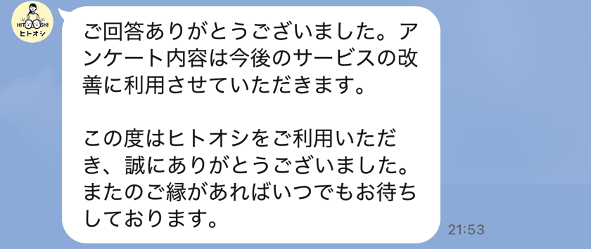

Hello! I'm [@Ryo54388667](https://x.com/Ryo54388667)!☺️

 

This time, I'm going to walk you through **what it was actually like to withdraw from Hitooshi**!

 

I used the marriage-hunting service "Hitooshi" for about 5–6 months and withdrew in early 2025.

Here's the thing about withdrawing: there's far less information about it than about joining. I remember searching things like "will they pressure me to stay? that would be awkward.." and "am I going to get hit with a cancellation fee?" before I quit.

So in this article, I'll share the actual LINE screenshots from my withdrawal and cover the full flow — the steps, the money side, and how to choose between withdrawing and pausing. It should be useful both for people about to withdraw and for people checking "how easy is it to quit?" before signing up.

If you're not familiar with the service itself yet, start with [What is Hitooshi? (How it works, how it differs, who it suits)](/en/blogs/zakki/hitooshi-konkatsu) and this article will make much more sense.

## Hitooshi Withdrawal in 30 Seconds

Let me put the conclusion up front.

> Withdrawing from Hitooshi is just: tell them on LINE, then submit the "withdrawal application form." In my case, I sent the LINE message at night and the whole process was done the same evening. No retention pressure, and zero cancellation fees (my case: roughly 5–6 months of use on monthly billing).

| Item | Details |
| --- | --- |
| How to withdraw | Tell them via LINE → submit the withdrawal application form |
| Time it took | Done the same evening (about an hour and a half) |
| Retention pressure | None. They asked my reason once, that's all |
| Cancellation fees | 0 yen in my case |
| Caveat (current rules) | Cancelling within the 3-month minimum period incurs a fee |
| The pause option | Keep your membership for 1,980 yen/month (conditions apply) |

\*I withdrew in early 2025, when there were no term plans and billing was month-to-month. The service now has plans and a 3-month minimum usage period, so the second half of this article also covers the current rules based on the official terms.

## How I Actually Withdrew (My Experience)

This is the main event. From deciding to quit to being done, it was three steps.

### Step 1: Request Withdrawal Through the Official LINE

Everything on Hitooshi happens through LINE, and withdrawal was no exception.

As far as I remember, there was a withdrawal option in the official LINE menu and I applied from there (this was about a year and a half ago, so my memory is a little fuzzy on this one point..). The FAQ on the [official site](https://hito-oshi.com/) also says you just tell them via LINE that you want to withdraw, so if you can't find the menu, simply messaging your planner works fine.

Some of you might be thinking, "if I send 'I want to quit,' won't they get upset?"

Short answer: not at all. What came back was actually the exact opposite — a genuinely warm reply.

### Step 2: Your Planner Replies and Asks Your Reason

After I requested withdrawal, my matching planner replied that same evening. Here's the actual screen (the conversation is in Japanese).

As you can see, there was zero retention pressure. After "understood," there was just one request: would I mind sharing my reason for leaving, "as a reference for improving the service."

Full disclosure here: my real reason for withdrawing was that I'd started dating someone I met elsewhere.

But at the time I felt a bit awkward saying that, so I answered "work got busy"😅 They didn't dig any deeper — just "take care of yourself and good luck with work."

So if you're about to withdraw, here's what I want you to know: **you don't have to be honest about your reason for leaving**. There was zero sense of it being used as ammunition to keep me, so a one-line answer you're comfortable with is plenty.

My planner even remembered things from our first interview and sent me a warm send-off message. That human touch is the biggest difference from cancelling a mechanical matching app.

### Step 3: Submit the Withdrawal Application Form and You're Done

After the exchange with my planner, the admin office sent me a URL for the "withdrawal application form."

There was one important warning in the admin office's message: **your withdrawal is not complete until you submit the application form**.

> If the withdrawal procedure is not completed, monthly fees may continue to be charged, so please be sure to submit the application.
>
> (From the Hitooshi admin office's LINE message)

In other words, if you say "I quit" on LINE, feel satisfied, and forget the form, the billing can keep going. This is the one step you absolutely have to see through.

The form itself was just a short survey — pick your reason for leaving, that kind of thing — and took a few minutes. Once submitted, a completion message arrives.

Looking back at the timestamps: my planner's reply came at 8:29 PM, and the withdrawal completion message at 9:53 PM. I messaged them at night and everything was finished the same evening.

No "call this number to cancel," no talking your way past a sales pitch.. honestly, that alone was a relief.

## Does Withdrawing Cost Anything? Mine Was 0 Yen

Here's the money side of my experience.

In my case, **cancellation and penalty fees were 0 yen**. The only charge was the regular monthly fee — not a single extra yen for withdrawing.

One note: my final month's fee was charged in full, with no pro-rated refund. So the waste-free approach is to "use it up" and time your withdrawal to the end of a billing cycle (more on timing in the next section).

### The Current Rules: 3-Month Minimum Contract Period and Cancellation Fees

From here, this is based on the current (as of July 2026) [terms of service](https://hito-oshi.com/rule/).

Hitooshi now has a 3-month (90-day) minimum usage period, and cancelling mid-way incurs a cancellation fee. The formula in Article 5 of the terms:

> Amount owed on mid-term cancellation = the value of services already provided + a cancellation fee
>
> Cancellation fee = 20,000 yen (tax incl.) or 20% of the monthly fees for the remaining period, whichever is lower
>
> (From [Hitooshi's terms of service](https://hito-oshi.com/rule/), Article 5)

"20% of the remaining period" is hard to picture, so here's a rough guide calculated with the current 17,800 yen monthly fee.

| Remaining period at cancellation | Approximate cancellation fee |
| --- | --- |
| 1 month left | 3,560 yen |
| 2 months left | 7,120 yen |
| 3 months left | 10,680 yen |
| 6+ months left | 20,000 yen (the cap) |

\*Rough figures from 17,800 yen × 20% × remaining months. The actual amount depends on your plan and cancellation date, so always confirm with the admin office and the original terms.

Flip side: if you're past the 3-month minimum on monthly billing, there's no cancellation fee — exactly as in my experience. There's no "locked in forever" trap here, so you can relax on that front.

Also, if you change your mind right after signing up, you can use the cooling-off period (unconditional cancellation within 8 days of receiving your contract documents) provided the legal conditions are met. For the full picture on enrollment and monthly fees, including total-cost simulations, see [my Hitooshi pricing article](/en/blogs/zakki/hitooshi-price).

## When Should You Give Notice?

"If I tell them this month, does next month's charge stop?" — you're wondering that, right? Let me piece it together from my experience and the terms.

First, the premise: Hitooshi's monthly fee isn't billed on calendar month-ends. It's charged every 30 days, starting from your initial interview date (per the [official site](https://hito-oshi.com/) FAQ). If your first interview was April 10, your next charge lands around May 10 — that kind of rhythm.

On top of that, the terms (Article 14) say that unless you give notice at least 3 days before your desired contract end date, the contract auto-renews on the same plan.

So if you want to play it safe, **request withdrawal well before the 3-days-prior mark ahead of your next billing date**.

That said, few people remember their exact billing date. My recommendation: the moment you decide to quit, ask your planner "when is my next renewal date?" in the same LINE message. It costs you one message, and it gives you buffer for the form-submission lag too.

As covered earlier, your withdrawal doesn't count until the form is submitted. "Send the LINE at the end of the month, do the form later" risks an unintended charge for another 30 days — finish the application in one sitting.

## Withdraw or Pause: Which Should You Choose?

If you're not 100% sure you're done, there's also the pause (rest) option.

Under the current terms (Article 4), you can keep your membership while pausing introductions for a rest fee of 1,980 yen/month (tax incl.). The big benefit: you don't pay the enrollment fee again when you come back.

There's a condition, though: the pause option is only available to those who have used the service for 3+ months on the standard plan or above without cancelling (applies to those who signed up on or after November 16, 2024). You can't join and immediately pause.

A heads-up here: some older articles out there list the rest fee as 500 yen/month. The current terms say 1,980 yen, so always check the amount against [the original terms](https://hito-oshi.com/rule/).

One more interesting detail from my own withdrawal LINE: according to the admin office, if a price revision happens, rejoining after a full withdrawal means paying the new price — but if you pause instead, you resume at your old price. Around a price hike, pausing effectively works as a price lock.

So the decision comes down to this:

- Might restart once work calms down, or want to lock the pre-hike price → pause
- Started a relationship, or closing this chapter of dating life entirely → withdraw

## What About "Success Withdrawal" (Couple Withdrawal)?

For those searching "Hitooshi success withdrawal" — let's sort out the terminology.

The phrase "success withdrawal" (seikon-taikai) never appears in Hitooshi's terms. It's traditional marriage-agency vocabulary, where agencies charge a 200,000–300,000 yen success fee when you leave to get married. Hitooshi's success fee is 0 yen, so even if you leave because you hit it off with someone they introduced, the procedure is exactly the normal withdrawal described in this article.

The company itself calls leaving-because-you-became-a-couple a "couple withdrawal." No special paperwork, no special charges — they just congratulate you on the way out.

There's even a nice bonus: if you're on a 6- or 12-month plan and withdraw mid-term because you've become a couple with someone Hitooshi introduced, 100% of the monthly fees for the remaining period are refunded (Article 5 of the terms). Committing to a longer plan doesn't punish you for succeeding early.

One exception: the IBJ plan (which connects to a partner marriage-agency federation) has its own fee schedule, including meeting-cancellation fees. If you're on that plan, check around Article 10 of the terms.

## What Happened After I Withdrew

For reference, a little about my life after withdrawal.

As I mentioned, I withdrew because I'd started dating someone I met on a matching app I was using in parallel. The relationship didn't come through Hitooshi itself, but the experience of clocking first-meeting reps with a planner cheering me on absolutely paid off later.

What to talk about at a first meeting, how to carry yourself. Those muscles only grow with repetition.

I've written about my actual time on the service (introduction pace, what the meetings were really like) in [my full review](/en/blogs/zakki/hitooshi-review) — check it out if you're wondering "so how does someone who quit actually rate this service?"

## If You're Thinking About Joining

Some of you are reading this as pre-enrollment research. That caution is exactly right.

Having gone through the exit myself, my take is: this service is as well-built at the exit as at the entrance. One LINE message sets things in motion the same day, there's no clingy retention play, and you pay nothing beyond what the rules say. Being easy to quit is the flip side of being safe to start.

If you do join, using a referral code gets you 5,000 yen off the enrollment fee. Feel free to use mine☺️

▼Sign up here!!

[https://hito-oshi.com/?ref=shoukai-app](https://hito-oshi.com/?ref=shoukai-app)

1. Apply via the official website or official LINE
2. When asked "How did you hear about Hitooshi?", choose "Referred by an acquaintance"
3. Enter the referral code below

▼Referral code

<Copyable>A2R7FE3K</Copyable>

Give it a try!

## Summary: Quitting Hitooshi Was Almost Anticlimactically Easy

To wrap up, here are the key points.

- Withdrawal is just a LINE message plus the withdrawal application form. Mine was done the same evening
- No retention pressure. They ask your reason once, and you don't have to be fully honest about it
- Your withdrawal isn't complete until the form is submitted — otherwise monthly charges can continue
- Cancellation fee is 0 yen once you're past the 3-month minimum (mid-term cancellation within it incurs a fee)
- Billing runs every 30 days from your initial interview date. Ask your planner for your renewal date and apply well before the 3-days-prior deadline
- Not sure yet? The 1,980 yen/month pause is an option (3+ months of use required)
- Leaving as a couple ("couple withdrawal") uses the same procedure. On 6/12-month plans, the remaining months are fully refunded

Some frequently asked questions about withdrawing:

### Can I withdraw by phone or email?

A. The official guidance assumes LINE, and no phone or email withdrawal desk is listed on the official site. Hitooshi is a LINE-native service end to end, so messaging your planner or the official LINE account is the reliable route.

### Can I rejoin after withdrawing?

A. Yes. But per the guidance I received when I withdrew, two things are worth knowing: requesting the same planner incurs a nomination fee, and your fees will be the current prices at the time you rejoin. If there's any chance you'll come back, consider pausing instead of withdrawing.

### Will they pressure me to stay?

A. In my case, not even once. The reason question was framed purely as "for improving the service," and after I answered they sent me off warmly.

## Primary Sources 🔍

This article is based on my own withdrawal LINE messages (early 2025) and the following official sources (terms-related information as of July 2026). Rules and amounts may change, so always check the latest official information before you act.

- [Hitooshi official website](https://hito-oshi.com/) (withdrawal method and billing-cycle FAQ)
- [Terms of Service | Hitooshi](https://hito-oshi.com/rule/) (cancellation fees, pause option, auto-renewal, couple-withdrawal refunds)
- [Legal Disclosure (Specified Commercial Transactions Act) | Hitooshi](https://hito-oshi.com/law/) (contract period, cooling-off)

 

Thank you for reading to the end!

I tweet casually about tech and life, so feel free to follow me!🥺

[@Ryo54388667](https://x.com/Ryo54388667)
