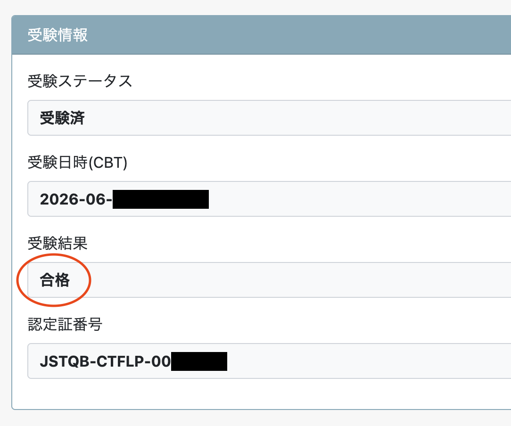

Hello! I'm [@Ryo54388667](https://x.com/Ryo54388667)!☺️

I usually work as an engineer in Tokyo! I mostly touch technologies like TypeScript and Next.js.

The other day I took the JSTQB Foundation Level exam — and passed! 🎉

This time I'm sharing **how I studied for the JSTQB Foundation Level**! I studied for about a month and a half. On top of a textbook and an app, I tried a generative-AI study method: building a "question-authoring engine" with Claude Code and generating and drilling 535 mock exam questions. I'll go into that in detail too.

I hope this helps anyone planning to take the exam, or developers who have started getting involved with testing at work.

## What Is the JSTQB Foundation Level?

JSTQB is Japan's certification board for software testing engineers. It has mutual recognition with ISTQB, the international certification body, so a certification you earn here is valid overseas as well.

Foundation Level (FL) is the entry-level certification, covering the "common language of software testing" — terminology, processes, and test techniques.

Here's an overview of the exam.

| Item         | Details                                    |
| ------------ | ------------------------------------------ |
| Format       | CBT (at a Pearson VUE test center)         |
| Schedule     | Year-round (any day reservations are open) |
| Duration     | 60 minutes                                 |
| Questions    | 40 (multiple choice)                       |
| Fee          | 22,000 yen (tax included)                  |
| Passing line | Said to be 65% (26 out of 40)              |

One thing to watch out for: the current exam follows **Syllabus 2023 (V4.0)**, applied since November 2024. Bookstores still carry materials for the old syllabus (2018 V3.1), so when buying study materials, make sure they say "Syllabus 2023 compatible."

## Why I Took It, and How Long I Studied

I'm primarily a frontend developer, but I've been getting more involved with testing at work. I kept feeling like "I'm kind of winging this whole testing thing..", and wanted to organize the knowledge systematically for once — that was my trigger.

In my case, I applied for the exam in mid-May 2026 and took it at the end of June. About a month and a half of studying, plugging away alongside my day job.

## Study Materials I Used

- "Tettei Kouryaku JSTQB Foundation Textbook & Question Collection, Syllabus 2023 Edition" (Impress, in Japanese)
- The official JSTQB syllabus (free PDF)
- The free app "Tesutomo" (テス友) — a practice-question app provided by Valtes
- A study project I built myself with Claude Code (more on this later)

"Tesutomo" is the go-to app for JSTQB prep, and it's perfect for drilling questions in spare moments. It's free, yet every question comes with an explanation — much appreciated.

## How I Studied

**1. Read the textbook cover to cover (May)**

First I went through the textbook once to get the big picture. At this stage I didn't try to memorize details — knowing "which chapter has what" was good enough for me.

**2. Alternate between practice questions and the textbook (June)**

After that first pass, practice questions became the main dish. Every time I got a topic wrong, I went back to the textbook to check it — I repeated that loop right up to exam day. JSTQB is less about "do you know it" and more about "can you pick the right answer when it's phrased in syllabus language," so volume of practice beats more input.

But then I ran into a problem.

"With Tesutomo and the textbook questions, by the second lap I'd already memorized the answers..😅"

I wanted fresh questions. But commercial question collections are limited. So I decided to have AI write the questions.

## Building My Own "Question Engine" with Claude Code 🤖

This is the core of my study method. I built a question-authoring engine for JSTQB as a custom skill for Claude Code.

### Design principle: AI is a "tutor," not a "textbook"

A common trap with AI-assisted studying is using it as "have AI summarize things and just read them" or "have AI solve the questions I can't." Nothing passes through your own head, so nothing sticks.

So I flipped the roles: **AI writes and grades the questions, and the one solving them is always me.**

### How it works

The workflow looks like this.

```
[AI generates a mock exam (40 questions aligned to the syllabus learning objectives)]
    ↓
[I hand-write my answers into the Markdown answer blanks]
    ↓
[I ask Claude Code to "grade and record the results"]
    ↓
[Auto-grading → every question's result and topic logged to a history JSON]
    ↓
[Topics I missed get re-asked within days, phrased differently]
```

Questions are generated as Markdown files, with an answer blank right after each question.

```markdown title="set-35.md"
**Q12.** When applying boundary value analysis (2-value), ...

- A) ...
- B) ...
- C) ...
- D) ...

> ✍️ Your answer: ___
```

I write my answer there and ask for grading, and the result gets recorded in the history JSON. Each question is tagged with chapter, topic, test technique, and difficulty, so the engine can re-ask only the topics I missed — from a different angle. It's basically spaced repetition with a bias toward wrong answers.

### Volume and results

Over roughly the two weeks right before the exam, my practice volume looked like this.

| Metric              | Value |
| ------------------- | ----- |
| Questions generated | 535   |
| Questions answered  | 330   |
| Overall accuracy    | 92.7% |

Per-chapter accuracy is also aggregated automatically, so weaknesses become crystal clear. In my case, Chapter 4 (Test Analysis and Design) was clearly my weakest at 84%, and I poured all my remaining time into it during the final stretch.

### The gotcha: AI-generated answer keys break

I want to say this loud and clear: when you have AI write exam questions, **the answer keys will just casually be wrong**. In one set, 7 out of 40 answer keys were incorrect. Seven!! 😇

As a countermeasure, I added a Python script that mechanically cross-checks three places — the answer marked in the question heading, the right/wrong analysis in the explanation, and the answer key in the history JSON — and forces a rewrite whenever they contradict. If you try AI question generation, I strongly recommend automating at least the answer-key validation.

### Honest impressions

As a way to rack up practice volume, AI mock exams were fantastic. That said, the real exam felt a bit harder.

What came closest to the real thing was the mock exam in the final chapter of the textbook. My personal recommendation is the combination: use AI mock exams to get your reps in, then use the textbook's mock exam as the final dress rehearsal.

## Where I Struggled

### 1. The wording is roundabout

JSTQB question text reads like translated prose, and the phrasing is peculiar. On top of patterns like "which of the following is NOT..." and "which is the MOST appropriate...", the answer options themselves are wordy.

Even with solid knowledge you can slip on reading comprehension, so I'd say practicing with full mock-exam-style question sets to get used to "that phrasing" is a must.

### 2. Calculation and application questions on test techniques (Chapter 4)

Equivalence partitioning, boundary value analysis, decision tables, statement/branch coverage — the calculation and application questions. Unlike knowledge questions, if you don't practice these hands-on, you will drop them in the real exam.

I had a chronic weakness — repeatedly miscounting invalid classes in equivalence partitioning — which my history data exposed, and I ground it down intensively once I knew.

## Exam Day

Honestly, it was harder than I expected.

I was scoring around 90% in practice, but in the real exam there were quite a few questions where I could only narrow it down to two options. I had time left over for review, but it felt like a close call. Even if you score high in practice, don't get complacent.

## How to Check Your Result Online ✅

I got genuinely lost here, so let me write it down.

"When are results announced? Do they email you?"

In my case, no pass/fail email ever came. You have to go check for yourself. I was able to see my result three to four days after the exam, on the JSTQB certification exam application website.

Here are the steps.

1. Log in to the JSTQB certification exam application website
2. Open "受験資格情報確認" (Exam Eligibility Information) in the menu
3. Click "詳細" (Details) at the left end of the table
4. Scroll down to the "受験情報" (Exam Information) section
5. Your result is shown in the "受験結果" (Exam Result) field

Here's what the screen actually looks like.



The word 合格 ("Pass") — never gets old no matter how many times I look at it ☺️ If you passed, your certificate number is shown on the same screen.

## Advice for Future Test-Takers

### 1. Nail the terms that come in pairs

JSTQB loves to probe the difference between paired concepts. For example:

| Concept A            | Concept B          | How it's tested                              |
| -------------------- | ------------------ | -------------------------------------------- |
| Test level           | Test type          | Which classification is being discussed      |
| Statement testing    | Branch testing     | Coverage calculation and subsumption         |
| Confirmation testing | Regression testing | "Is it fixed?" vs "Did anything else break?" |
| Error                | Defect / Failure   | Which link in the cause-effect chain         |

The answer options will slyly include "the correct definition of the neighboring concept." Don't memorize definitions in isolation — learn them as contrasting pairs.

### 2. Get used to the exam's phrasing

As mentioned, the question wording is roundabout. Flashcard-style studying alone will leave you blindsided on the day, so practice reading a substantial volume of question text in mock-exam format.

### 3. Assume the real exam is harder than your practice

Your practice accuracy will always run higher than the real thing (you get used to the same questions). Don't aim for exactly the 65% passing line — polish yourself to around 90% in practice with room to spare, and you'll survive the real exam's close-call feeling.

## Wrapping Up

To sum up my study method:

- Read a Syllabus-2023-compatible textbook once for the big picture
- Rack up practice volume with an AI question engine, tracking and crushing missed topics
- Finish with the textbook's final-chapter mock exam as a real-level dress rehearsal
- Focus on paired terms and Chapter 4 calculation questions

Next I'm thinking of taking on the Advanced Level (Test Analyst). If I do, I'll write about that too!

If you have even better study methods, please let me know\~

Thank you for reading all the way to the end!

I tweet casually about whatever, so feel free to follow me!🥺
