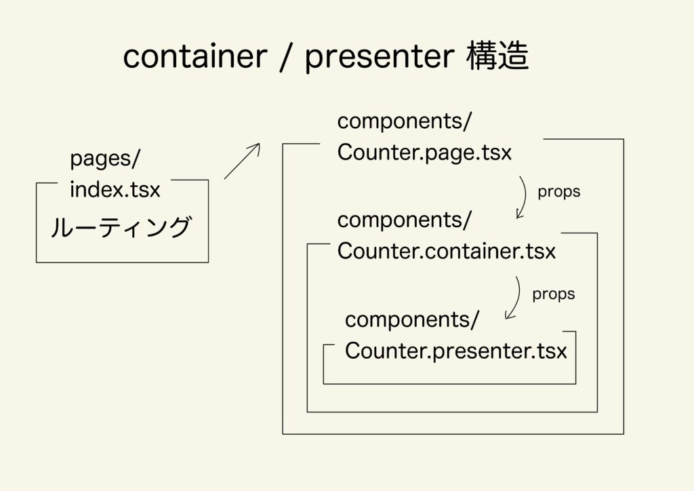

## About Directory Responsibilities

I started writing code with this directory structure at work, so I'll output this as a memo.

[The article I referenced is here](https://www.nochitoku-it.com/containr-1). It had diagrams and was very easy to understand!

<br />

First, I'll explain the overall picture.

Imagine the application as a simple number counting app.


The overview of each file's responsibilities is like this:



**src/pages/index.tsx**

This handles routing responsibilities.

<br />

**src/components/Counter.page.tsx**

This is a component for wrapping with layout components and adding meta elements like browser information. It handles the rendering responsibilities for parts other than the HTML main tag.

<br />

**src/components/Counter.container.tsx**

This handles logic responsibilities.

<br />

**src/components/Counter.hooks.tsx**

This is where only hooks logic is written. You might think "Doesn't container have the same responsibility?" Container can have various logic other than hooks, and collecting just custom hooks improves readability, so it's plugged into container.

<br />

**src/components/Counter.presenter.tsx**

This is where only UI rendering is written.

These are the overall responsibilities.

Simply put, it's the image of continuously props-drilling from page → container → presenter.

<br />

## About Each Component's Code

Now that you understand the overall picture, looking at each component's code will deepen understanding and make it easier to visualize.

```typescript title="pages/index.tsx"
import CounterPage from "../components/Counter.page";

//Props for data fetched with SSG or SSR
type StaticProps = {
  tabTitle: string
}

export default function Home ({ tabTitle }: StaticProps)  {
  return (
    
  )
}
```

As NextPageType indicates, this component only handles the basic Next.js functionality of routing. If doing data fetching with SSG or SSR, it would be described here and data would be passed to page.tsx under components via props.

<br />

```typescript title="components/Counter.page.tsx"
import { FC } from "react"
import CounterContainer from "./Counter.container"
import Layout from "./Layout"

type ProsType = {
  tabTitle: string
}

const CounterPage: FC = ({ tabTitle }) => {
  // NOTE: Component that wraps container with header and footer
  return (
    
      
    
  )
}
export default CounterPageCounter.page.tsx handles rendering of parts other than the HTML main tag.Here, Counter.container.tsx is wrapped with the Layout.tsx component.Layout.tsx simply has the responsibility of setting browser tab variables fetched via SSR to the Head component.Let me also include Layout.tsx:import { FC, ReactNode } from "react"
import Head from "../node_modules/next/head"

import styles from "../styles/Home.module.css"

type PropsType = {
  tabTitle: string
  children: ReactNode
}

const Layout: FC = ({ tabTitle, children }) => {
  // NOTE: Component that describes things related to rendering other than main
  return (
    
```

`{children}`

`) } export default Layout`

In Counter.page.tsx, for example, it would be good to wrap Counter.container.tsx with header components or footer components within this component.

```typescript title="components/Counter.container.tsx"
import { useCounter } from "./Counter.hooks"
import CounterPresenter from "./Counter.presenter"

type ProsType = {
  tabTitle: string
}

const CounterContainer = ({ tabTitle }) => {
  // NOTE: Component that passes logic
  const { count, increment, decrement } = useCounter();
  return (
    
  )
}
export default CounterContainer
```

Finally, the container appears as mentioned in the title! It's been a long journey (^^;

This mainly handles logic responsibilities. More specifically, it has the role of passing logic to presenter.tsx via props.

<br />

However, looking at the code, you can see it's not writing heavily detailed logic. Since most logic in this application can be written with custom hooks, it's delegated to hooks.tsx described later. Normally, container would have logic for formatting or processing data passed via props from page.tsx.

<br />

```typescript title="components/Counter.hooks.tsx"
import { useState } from "react"

// NOTE: Write the main body of logic
export const useCounter = () => {
  const [count, setCount] = useState(0);

  const increment = () => {
    setCount(prev => prev + 1);
  }

  const decrement = () => {
    setCount(prev => prev - 1);
  }

  return { count, increment, decrement }
}
```

<br />

In this application, the main body of logic is written in this file.

It's the same as a custom hook. Looking at the code, useState update functions and increment/decrement functions are written here. In the current sample code, it's not written for explanation purposes, but normally it would be better to use useCallback for performance improvements.

<br />

```typescript title="components/Counter.presenter.tsx"
import { FC } from "react";

type PropsType = {
  count: number;
  increment: () => void;
  decrement: () => void;
}

const CounterPresenter: FC = ({ count, increment, decrement }) => {
  // NOTE: Write things related to display. Don't write logic.
  return (
    
```

# `Simple Counter`

` - count: {count} +`

`) } export default CounterPresenter`

Finally, the last one. This handles the UI inside the HTML main tag.

Here, no logic is written at all, only the responsibility of displaying using functions and variables passed via props from parent components. The part where CSS is applied for styling would be in this file.

<br />

Good work. This is an example of container/presenter directory structure. I wrote about the directory structure at work as a memo\~ Thank you for reading to the end!

<br />

<br />

If this article helped you, I'd be moved to tears if you'd send a tip (an Amazon gift card) from my wish list 🥺

<LinkCard url="https://www.amazon.jp/hz/wishlist/ls/2FEMYG87ZXIME?ref_=wl_share" />
