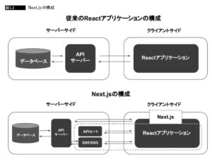

こんにちは！りょた([@Ryo54388667](https://x.com/Ryo54388667))といいます(^o^)

 

今回はNext.jsについての書籍「TypeScriptとReact/Next.jsでつくる実践Webアプリケーション開発」を読了したので、そのレビューを書いていきます。

- このNext本が気になっていたのでレビューを知りたい。
- なんとなくNext.jsを書いていたので、細かな仕組みを知りたい。

こんな人に読んでいただけると幸いです！

 

## はじめに

今回のレビューはあくまで、実務1年未満のジュニアof ジュニアの僕の視点のレビュー(あえて太字にしました。。)です。あまり期待せずに読んでいただけると助かります。。。

と、ぎちぎちに予防線を張ったところで、個人的に気になった部分について書いていきます！

 

## Next.jsの構成について

Next.jsの基本的な仕組みについてです。

僕は当初、サーバーサイドレンダリングと聞いても、サーバー側で何かしてくれているんだろう、程度の理解でした。この書籍から引用した図を見てください。

「サーバー」と一言で済ませることができないとわかります。

APIサーバーの他に、Next.jsが提供しているサーバーがあります。サーバーサイドレンダリングの意味するサーバーはNext.jsが提供するサーバーのことだと理解しました。僕はてっきり、既存のAPIサーバーに何か機能を付与しているものだと思っていました。大きな誤解ですね！ここで押さえられてよかったと思っています！

 

## HistoryAPIについて

この単語は初めて聞きました。本書にはこう書かれています。

> 普段開発者としてあまりHistory APIを意識することは必要ないですが、履歴をブラウザに記録させる機能としてpushStateやreplaceStateという機能の存在を知っていて損はないでしょう。また、popstateというブラウザの戻る・進むボタンが押された際に発生したイベントなど実装に組み込むことができます。 scrollRestorationというプロパティもあり、ブラウザの戻る・進むボタンが押され、履歴間の移動があった時のスクロール位置を制御できる機能もあります。
>
> (TypeScriptとReact/Next.jsでつくる実践Webアプリケーション開発)

普段、全く意識していませんでした(^^;

Next.jsが提供しているRouterを利用しているので、そのことは全く頭にありませんでした。調べてみると、HTML5で導入された機能のようですね！このように、盲目的におこなっていることの仕組みを教えてくださるのは非常にありがたいなーと思っています。

 

また、本書もそうですが、技術書あるあるとして個人的に感じているのは、技術書の「コラム(column)」は大体タメになることが書かれている！ということです。エンジニアの先輩がよく、「ちなみにですが〜」と言う時は大体、有益なことなので、そのパターンと似ています。

 

## コンポーネント設計について

最近は個人的にこのトピックに興味があります！

興味を持った経緯としては、数ヶ月前まで「コンポーネント設計といえば、Atomic Designっしょ！」みたいな感じで、勉強していたのですが、いざ、実務でコンポーネント管理をしていると、いくつか問題が生じて、考え直していたからです。

問題としては、organisms多過ぎ問題だったり、ファイル数多過ぎたり、などなど。。。少し立ち止まって考えるフェーズなのかなと思っています。

 

少し、話が逸れたので、書籍の話に戻ります。

まず、コンポーネント化の意義について。

> コンポーネントを適切に切り出すと、UIデザインや実装が効率的になります。 同じ機能を持つ部品を再利用できるため再実装の必要がなく、デザインや仕様の変更の際には該当コンポーネントを修正するだけで容易に対応できます。
>
> (TypeScriptとReact/Next.jsでつくる実践Webアプリケーション開発)

と著者は書いています。ここで述べられているように、**コンポーネント化の意義は端的に言うと、再利用性です。**

 

「Atomic Designに寄せなければ！」というマインドになると、手段と目的が逆転してしまうので、注意が必要ですね！常に、コンポーネント化の意義である、再利用性について立ち戻らないといけません。

とはいえ、「うーん。。。」と思うような部分もあります。「“適切“に取り出すと」の部分です。

「適切」がムズいんですよぉぉ。。。

といった感情もあります。ここは完全に経験則と現場のルールに沿う部分ですね。

 

それを知る意味でも、後の章にハンズオンのセクションは大事です！あくまで、一例に過ぎませんが、一つの例を知っているだけで、他の例と比較ができるようになるので、個人的にはありがたいです！

 

次に、Presentational ComponentとContainer Componentの概念についてです。僕はこの概念について学び直しができて非常によかったです。以前、[現場で利用しているアーキテクチャについてのアウトプットとして、このような記事](/ja/blogs/next_js/nextjs-container-presenter)を書きました。

方法論としては、理解していましたが、根本の部分についてはまだまだ理解が浅いなぁと感じていたので、この概念の説明がされていて助かりました〜

 

この概念を端的にいうと、**「見た目とロジックを分離し、責務を明確にわけよう！」**&#x3068;いうものです。

では、Presentational Componentから詳しく見ていきましょう！

 

> 基本的にpropsで渡されたデータを元に適切なUIパーツを表示することだけをします。 スタイルの適用もこのコンポーネントで行います。 Presentational Componentの中では、内部に状態を持たせず、API呼び出しなどの副作用を実行しません。 propsのみに依存することで、同じpropsに対して常に同じものが表示されるため、デザインに関してデバッグが容易になります。 また、デザインだけを修正したい場合にも、振る舞いや外側の影響を考える必要がありません。
>
> (TypeScriptとReact/Next.jsでつくる実践Webアプリケーション開発)

内部ではロジックは書かないということですね！枠のみを規定していて、表示内容は完全に、外部から取り込み、UIにするコンポーネント。後述しますが、ロジックを書かないことで、storybookによるUIテスティングが容易になります。デザインが崩れていないかチェックするのはこのコンポーネントだけで事足りるようになるのは非常にありがたい限りです。

 

続いて、Container Componentについてです。

> Container Componentではデザインは一切実装せずに、ビジネスロジックのみを担います。 Container ComponentではHooksを持たせて、状態を使って表示内容を切り替える、APIコールなどの副作用を実行するなどの振る舞いを実装します。 また、Contextを参照しPresentational Componentへ表示に必要なデータを渡します。
>
> (TypeScriptとReact/Next.jsでつくる実践Webアプリケーション開発)

**このコンポーネントはデザインは一切責務を担わず、ロジックのみの責務、というのが大きな特徴ですね！**

しかし、疑問に思う部分もあります。Container ComponentでHooksを持たせるなら、Hooksにロジックの責務を集中させてもよいのではないかと思ったりしています。

業務で、Container層にロジックを直書きするよりも、圧倒的に、Hooksに記述することの方が多いです。Container層にはカスタムhookしか書いていないことも多いので、「これじゃない感」が否めません。

Presentational ComponentとContainer Componentの概念も完全な設計ではないので、これを軸として工夫していく必要がありそうだと思いました。盲目的にならず、絶えず疑問を持ちながらカスタマイズしていきたいところです。

 

## storybookについて

僕はこの書籍を手に取った理由の7割はこのセクションがあるからといっても過言ではありません。storybookについて書かれた日本語の書籍はあまり見かけません。需要が限られているからでしょうね。。。(^^;

 

しかし、さまざまな企業のGitHubのリポジトリをみる限り、storybookが導入されています。コンポーネント管理をするなら導入することが多いもののようですね！学習しようとするも、なかなか情報がなくて、苦労していた時にこの書籍に、このセクションがあったので、手に取りました。

 

今後、Storybookでコンポーネント管理してよかった！と思えるような開発体験を味わえるように勉強していきたいところです！身の上話が長くなってしまいましたので、そろそろ本題に入ります。

 

> Storybookを使用することで、独立した環境でUIコンポーネントの見た目や振る舞いを確認でき、コンポーネントの管理がしやすくなります。
>
> (TypeScriptとReact/Next.jsでつくる実践Webアプリケーション開発)

これがコンポーネント管理の最たる目的ですね。

よほど時間的な余裕のある開発以外は、画面のデザインデータが揃ってから開発を行うというより、デザインデータが随時作成される、というような開発状況が多いのではないかと思います。こういった状況で、新しい画面のデザインデータが上がってきた時に、素早く、既存のコンポーネントとそのページ独自のコンポーネントかどうか判断できることが、開発のスピードに大きく関わります。そんな時に、storybookで適切にコンポーネント管理できていれば、その区別が円滑にできそうな気がします。

 

この章では基本的な記述方法が書かれていました。

もっと欲をいえば、具体的な運用方法まで記述してほしかったですね。**storybookの大きな問題として、「陳腐化」が挙げられます。**&#x73;toryファイルを作成しても、開発途中で、コンポーネントのpropsが増えたり、型が変更されたり、など、その都度、storyファイルの修正が必要になってきます。これを怠ると、storyファイルが置き去りになり、コンポーネントの管理として杜撰な状態になってしまいます。気にかけて、storyファイルを修正していくことも、運用面では重要になってきます。

 

この部分のノウハウを教えてほしかったところです。修正しやすい運用、頑張り過ぎない管理などなど。

 

## レビューpart①の最後に

この書籍の印象に残った部分をざざっと書いてみました。今回はpart①ということで、ハンズオン以外の部分について書きました。次回、part②ではハンズオン部分の印象に残った部分、勉強になった部分をまとめてみようと思います。

最後といっては、なんですが、僕がこの書籍をおすすめするなら、どんな人状況の人か考えてみました！

**Next.jsをその他の教材でアプリを一通り終え、さらに環境構築からデプロイを一気通貫で知りたい人！**

です！Next.jsやReactを初めて学ぶ時にこの書籍を選ぶのは悪手だと思います(^^;

 

概要部分は全く問題なさそうですが、本書の醍醐味である、ハンズオン部分が相当厳しいと思います。

著者が本気出してます笑

 

ネガティブなことを言いましたが、ある程度、Next.jsの素養のある人にはうってつけの書籍だと思います。個人的には、非常に勉強になりました。いくつか誤解していた部分に気づかせてくれただけで、大きな価値があります！Next.jsをさらに学びたい方はぜひぜひ購入してみてください！

最後まで読んでくださり、ありがとうございました！

 

<AmazonLink href="//af.moshimo.com/af/c/click?a_id=2351007&p_id=170&pc_id=185&pl_id=4062&url=https%3A%2F%2Fwww.amazon.co.jp%2Fdp%2FB0B74C3TNQ" image="https://images-fe.ssl-images-amazon.com/images/I/51XvdoWeGFL._SL160_.jpg" title="TypeScriptとReact/Next.jsでつくる実践Webアプリケーション開発" trackingImage="//i.moshimo.com/af/i/impression?a_id=2351007&p_id=170&pc_id=185&pl_id=4062" />
