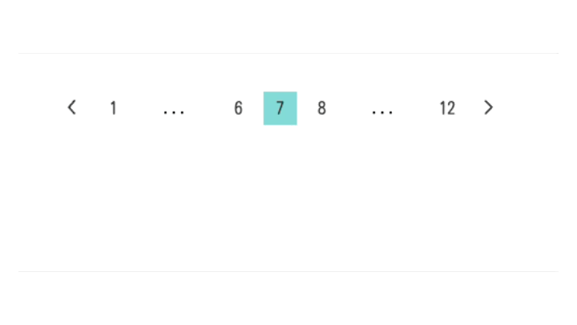

Hello! I'm [@Ryo54388667](https://twitter.com/Ryo54388667)! ☺️

I usually work as an engineer in Tokyo!

I mainly work with technologies like TypeScript and Next.js. This time I'll introduce how to implement pagination with an ellipsis menu!

<br />

## What We're Implementing

First, I think it's best to show you what we're implementing.



This is [already implemented on the top page of this blog](/blogs). [This Storybook version](https://story.ryotablog.jp/?path=/docs/components-pagination--docs#page%207%20and%20total%2045) might be easier to see.

This UI is implemented on various blogs, so if you search the web, you'll find many implementation methods. However, I thought pagination with ellipsis menus like this is somewhat rare, so I wrote this article.

<br />

<br />

## Implementation Details

<br />

For those who just want the code, please check out this file!

<br />

Let me explain the details.

<br />

```typescript
const rate = totalCount / PER_PAGE;
const totalPages = rate 


```

If this article helped you, I'd be moved to tears if you'd send a tip (an Amazon gift card) from my wish list 🥺

<LinkCard url="https://www.amazon.jp/hz/wishlist/ls/2FEMYG87ZXIME?ref_=wl_share" />
