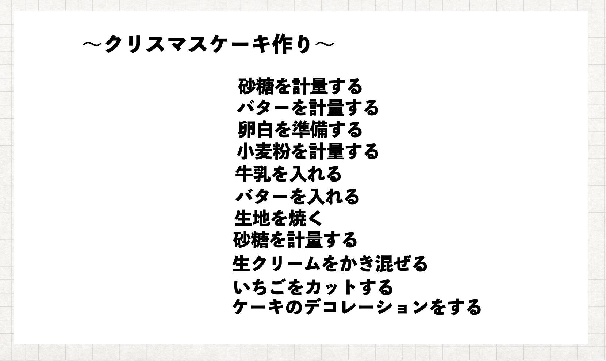
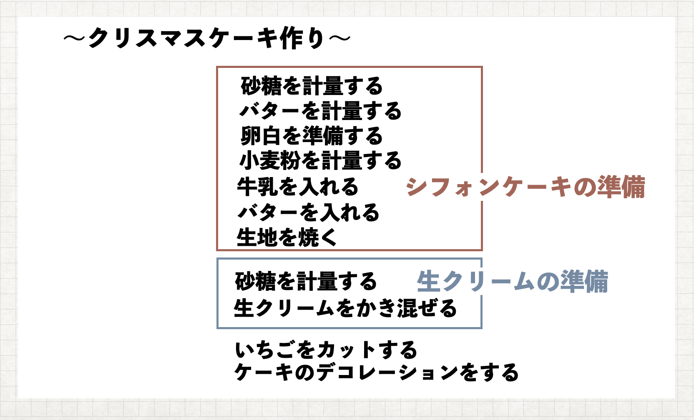
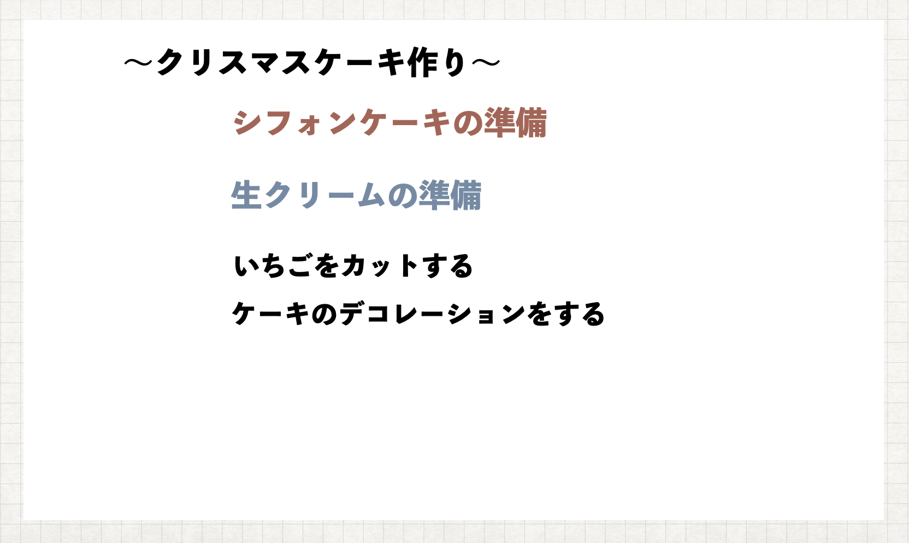
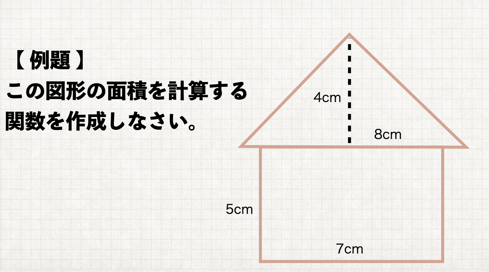

こんにちは！りょた([@Ryo54388667](https://twitter.com/Ryo54388667))といいます(^o^)

無関係な下位問題の抽出について直感的に理解できるように説明していきます。

- 下位問題の意味がわからない。
- 無関係な下位問題の抽出をイメージでとらえたい。

書籍リーダブルコードの理解の助けになれば嬉しいです。

<br />

## 無関係な下位問題の抽出をイメージで捉えよう

僕は、この章のタイトルを見た時、何を言っているのか全くわかりませんでした。

<br />

無関係？何と関係がない？

下位問題？そもそも上位と下位の区別がつかないのですが。。。

抽出？はぁぁ。。。（ため息）

<br />

こんな状態でした。読み進めていて、イメージが掴めた時、急に理解が進みました。先にイメージを掴んでおくと、理解のスピードがケタ違いです。というわけで、直感的なイメージから説明していきます。

<br />

【シチュエーション】

娘から、「ママ、24日にクリスマスケーキを作りたい。」そう言われた。しかし、24日は仕事がある。だから夜に短時間で作らないといけない。この状況でクリスマスケーキの作り方について調べてみた。

<br />

この状況を想像してください。



僕がこの説明書を見て思うのは、

「砂糖を計量する作業はがいくつかあるなぁ。シフォンケーキに混ぜるのか？それとも、ホイップクリームに混ぜるのか？」

「というか、シフォンケーキは作りたくないぞ。シフォンケーキはあらかじめ準備をしておきたい。。。」

<br />

「いやいや、シフォンケーキ作りこそ、クリスマスケーキ作りの真髄だ！ないがしろにするな！」という意見の人には謝罪をしますが、少なくとも、このシチュエーションだとシフォンケーキは準備しておくのが、現実的でしょう。

<br />

説明書のどこを改善すればいいでしょうか。説明書をこのように改善してはどうでしょうか。



こうすると説明書を初めて見た人でも何をすればよいのか分かり易いですね！全体的なイメージとしてはこのような感じです。

ケーキを作るという目的に対して、シフォンケーキを作るというのは、独立した作業であり、別の時間に準備するうこともできます。

そういう意味で、目的に対する「無関係の下位の問題」と言えそうです。また、別の時間に準備できるという意味で、「抽出できる」とも言えます。

<br />

これをコードの問題に戻して適用すると、

「大きく関わらない部分は、別の場所に切り出し、関数化する方が良い」という意味になります。

この全体像を掴んでから、リーダブルコードの「無関係な下位問題を抽出する」という章を読んでみてください。理解の度合いが全然違うと思います！

<br />

## 実際にコードで考えてみる

実際に書籍を読んでみると、イメージを掴んだとはいえ、難しいコードが並んでいます。

そこで、より簡単なコードに適用して説明をしていきます。

<br />

【問題】

この図形の面積を計算する関数を作成しなさい。



この問題の目的はこの家型の図形の面積を求める関数を作ることです。

```typescript
function calcHouseArea () {
	let verticalLength = 5;
	let horizontalLength = 7;
	let bottom = 8;
	let height = 4;
	
	let answer1 = verticalLength * horizontalLength;
	let answer2 = bottom * height /2;

	return answer1 + answer2;
}
```

このコードの無関係の下位問題を抽出してみましょう。長方形の面積を求めることと、三角形の面積を求めることは、上位の目的の準備に過ぎませんということは、関数の外に抽出した方がいいでしょう。

<br />

実際にコードを書くと、

```typescript
function calcSquareArea (verticalLength, horizontalLength) {

	let answer = verticalLength * horizontalLength;

	return answer;
}

function calcTriangleArea (bottom, height) {
	
	let answer = bottom * height /2;

	return answer;
}

function calcHouseArea () {
	let answer1 = calcSquareArea(5, 7);

	let answer2 = calcTriangleArea(8, 4);

	return answer1 + answer2;
}
```

比較的、見やすくなったのではないかと思います。いかがでしょうか、無関係の下位問題を抽出する、ということが理解できましたか？

<br />

少しでも理解につながれば幸いです。書籍リーダブルコードの「無関係な下位問題の抽出」の章にはそのほかの事例も書かれています。

イメージで理解できた人はぜひこの章の他の部分にも目を通してみてください(^^)

最後まで読んでくださり、ありがとうございました！

<AmazonLink href="//af.moshimo.com/af/c/click?a_id=2351007&p_id=170&pc_id=185&pl_id=4062&url=https%3A%2F%2Fwww.amazon.co.jp%2Fdp%2F4873115655" image="https://images-fe.ssl-images-amazon.com/images/I/51xHT9ZnmNL._SL160_.jpg" title="リーダブルコード ―より良いコードを書くためのシンプルで実践的なテクニック (Theory in practice)" trackingImage="//i.moshimo.com/af/i/impression?a_id=2351007&p_id=170&pc_id=185&pl_id=4062" />
