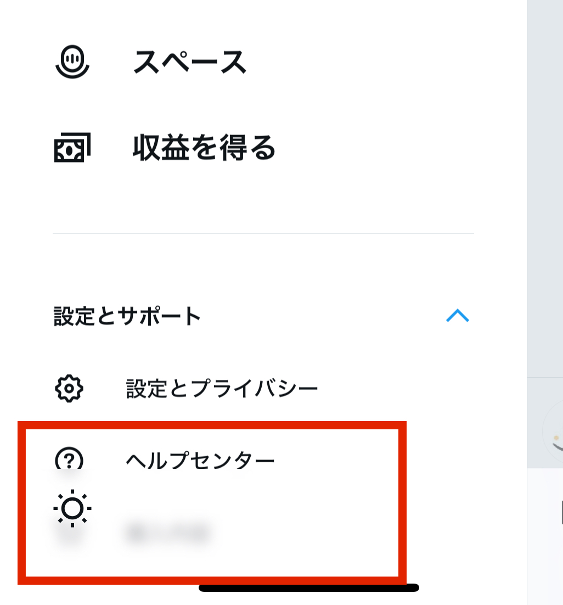

こんにちは！[@Ryo54388667](https://twitter.com/Ryo54388667)です!☺️

普段は都内でエンジニアとして業務をしてます！

主にTypeScriptやNext.jsといった技術を触っています。

<br />

今月のこのメディアのアップデート内容を紹介していきます！

<br />

## アプリケーションのアップデート

<br />

### 画像のポップアップ機能

詳細ページの画像をクリックすると、大きな表示で見ることができるポップアップ機能を追加しました。

記事内の小さな写真をクリックすると、大きな画面で写真を拡大して見れます(下記のもの)。画像によってはviewエリアより大きくなってしまうのが今後の改善点ですかね。。

<br />


<br />

<br />

### 前後記事へのナビゲーション

新しい機能として、記事の前後に簡単に移動できるナビゲーションを追加しました。この記事の最下部にあります。

ある記事を読んでいるときに「次の記事」をクリックすると、次の記事にすぐに移動できます。実装するときに悩んだのは、ユーザーにとって「次の記事」を左右のどちらに置くのが自然か、ということ。結局、日付を明示することにしました。

参考

[https://wk-partners.co.jp/homepage/blog/hpseisaku/next-prev/](https://wk-partners.co.jp/homepage/blog/hpseisaku/next-prev/)

<br />

<br />

### AWS RUMの読み込みにrequestIdleCallbackを利用

アプリのパフォーマンスを向上させるために、リアルユーザーモニタリング（RUM）のデータを[requestIdleCallback](https://developer.mozilla.org/ja/docs/Web/API/Window/requestIdleCallback)を使って読み込むようにしました。

これにより、効率的なロードが行われるかと思います。ただ、Safariが非対応なので、泣く泣く条件分岐を入れました😇

詳しくは[こちらのコミット](https://github.com/ryota-09/ryota-blog/commit/98140ebe67911d99a3b23b35893bfa2217a5a2ab)をご覧ください。

toCのパフォ改善についてはこのyahooの記事を辞書的に見たりしています！ありがたや〜

<LinkCard url="https://techblog.yahoo.co.jp/entry/2022090530337093/" />

<br />

<br />

### issueの起票のためのボタンを実装

ユーザーが問題を報告できる「修正リクエストボタン」を追加しました。この記事の最下部にあります。

Zennにも詳細を記載しました！

[https://zenn.dev/ryota\_09/articles/77ca2efe5d23d0](https://zenn.dev/ryota_09/articles/77ca2efe5d23d0)

<br />

<br />

### 「New」ラベルを追加

新しく公開された記事には「New」のラベルが付くようにしました。

一応、「２週間以内」の記事にラベルをするようにしています。(２週間てw！古い！というツッコミは受け付けませぬ)。個人的に好きな色味にできて満足です👌

<br />

<br />

### １年以上前の記事にはラベルを追加

公開から1年以上経過した記事には「古い」のラベルを付けるようにしました。

[https://ryotablog.jp/blogs/modern-coding-review](/ja/blogs/css/modern-coding-review)

<br />

<br />

### Twitter用のOG画像を別で用意

Twitterでリンクを共有したときに、見栄えを良くするための専用のOGPタグを設定しました。`twitter-image.tsx`と命名すると、専用のOGP画像として作成してくれるようです。兼ねてから、TwitterのOG画像だけ、ボーダーの幅が微妙だなーと思っていたのですが、Twitter用に別でOG画像を用意できることを知り、改善しました。

<br />

参考

[https://nextjs.org/docs/app/api-reference/file-conventions/metadata/opengraph-image](https://nextjs.org/docs/app/api-reference/file-conventions/metadata/opengraph-image)

<br />

### 画像にBlur機能を追加

画像にぼかし効果を追加しました。

ただ、全ての画像にBlur機能をつけるとパフォーマンスが劇的に悪くなったり、通信量が跳ね上がったので、必要な箇所のみにしました。

<br />

[https://ryotablog.jp/about](/about)

<br />

<br />

### 記事一覧をフワっと表示

記事一覧が浮き上がるように修正しました。

詳しくは[こちらのコミット](https://github.com/ryota-09/ryota-blog/commit/311bcb18b85d6f48446469c7d5e362f1c3fcec80)をご覧ください。トップページのタブを切り替えた時に適用しています。

<br />

[https://ryotablog.jp/blogs](/blogs)

<br />

<br />

### Storybook内のコンポーネントにもフォントが適用される修正

Storybookのコンポーネントにもフォントが正しく適用されるように修正しました。

<br />

```tsx title=".storybook/preview.ts"
import React from "react";
import { Kosugi_Maru } from "next/font/google";
import type { Preview } from "@storybook/react";

import "../src/styles/globals.css"

const KosugiMaru = Kosugi_Maru({ weight: "400", subsets: ["latin"], display: "swap" });

const preview: Preview = {
  parameters: {
    controls: {
      matchers: {
        color: /(background|color)$/i,
        date: /Date$/i,
      },
    },
  },
  decorators: [
    (Story) => (
      <div className={`${KosugiMaru.className}`}>  <=== ここに追加  
        <Story />
      </div>
    )
  ],
};

export default preview;
```

<br />

<br />

### next/imageにGIF画像を適用

GIF画像をnext/imageでサポートするようにしました。unoptimizedをオフにすると対応できるようです。

```tsx
const isGif = src.endsWith(".gif");
<Image src={src} alt={alt} width={+width} height={+height} unoptimized={isGif} />
```

<br />

<br />

## インフラのアップデート

<br />

### AWS RUMを利用

[AWSのリアルユーザーモニタリング（RUM）](https://aws.amazon.com/jp/blogs/news/cloudwatch-rum/)を導入しました。Web Vitalsの経過を観察できます。

<br />

### サブドメインにStorybookを追加

Storybookをサブドメインに追加しました。

[https://story.ryotablog.jp/?path=/docs/document--docs](https://story.ryotablog.jp/?path=/docs/document--docs)

<br />

## Next Month's Roadmap

<br />

### サイドバーの改善

サイドバーがスクロールできることをより分かりやすくする予定です。

デザインとしてはTwitterの設定あたりのぼかしがいいのかなーと。

<br />



<br />

### Storybookのアクセシビリティテスト

Storybookにアクセシビリティテストを導入したいと考えています。

現状、lighthouseの色のコントラストの警告が出ているので、なんとかしたいなーと思っているところです。

<br />

### Web Vitalsの取得の自動化

Web Vitals（ウェブサイトの重要なパフォーマンス指標）の取得を自動化する予定です。

<br />

## まとめ

- 画像のポップアップ機能
- 前後記事へのナビゲーション
- RUMの読み込みにrequestIdlecallbackを利用
- issueの起票のためのボタンを実装
- 「New」ラベルを追加
- １年以上前の記事にはラベルを追加
- Twitter用のOG画像を別で用意
- 画像にBlur機能を追加
- 記事一覧のふわっと表示
- Storybook内のコンポーネントにもフォントが適用される修正
- next/imageにGIF画像を適用

<br />

以上が2024年6月のリリースノートです。最後まで読んでいただきありがとうございます。来月もできれば書きたい。いや、書きます。(たぶん)

<br />

最後まで読んでいただきありがとうございます！

気ままにつぶやいているので、気軽にフォローをお願いします！🥺

<Tweet id="1804299189662486824" url="https://twitter.com/Ryo54388667/status/1804299189662486824" />

<br />

<br />

もしこの記事が役に立ったら、欲しいものリストから投げ銭(ギフト券)していただけると泣いて喜びます🥺

<LinkCard url="https://www.amazon.jp/hz/wishlist/ls/2FEMYG87ZXIME?ref_=wl_share" />
