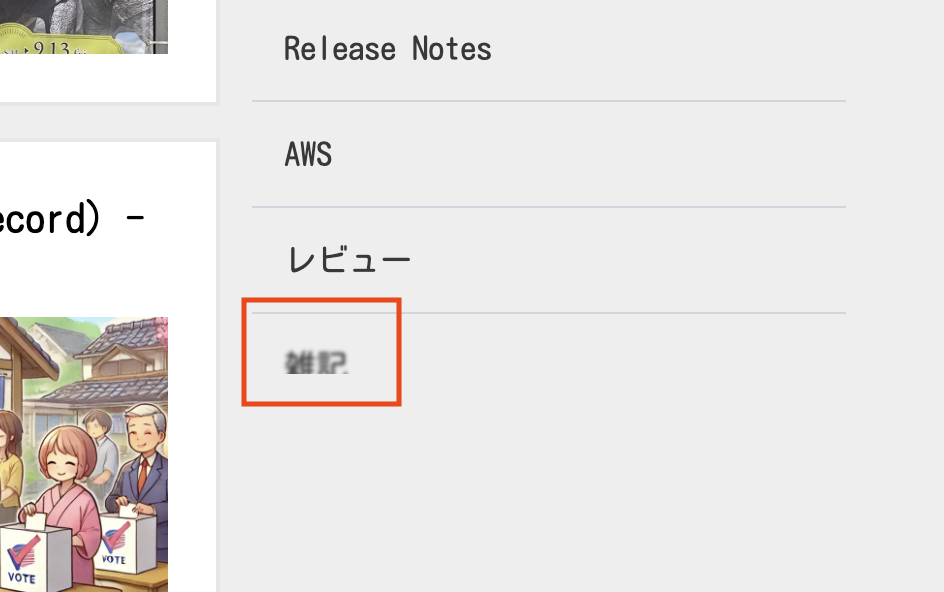
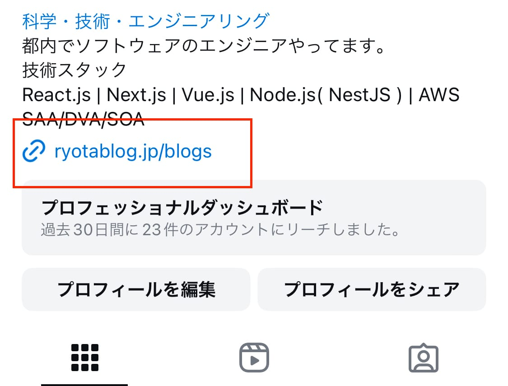
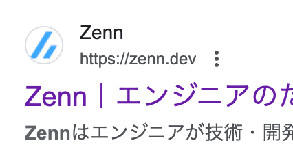
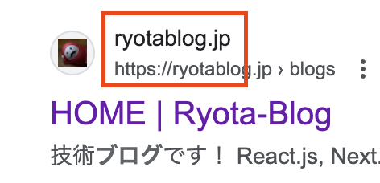

こんにちは！[@Ryo54388667](https://x.com/Ryo54388667)です!☺️

普段は都内でエンジニアとして業務をしてます！主にTypeScriptやNext.jsといった技術を触っています。

今月のこのメディアのアップデートを紹介していきます！

<br />

## アプリケーションのアップデート

<br />

### サイドバーの下部をぼかすように調整

画像に示したようなぼかし効果を入れてみました！

<br />



<br />

今回は[TailwindCSSのbackdrop-blur](https://tailwindcss.com/docs/backdrop-blur)を利用しました。

<br />

```html
<div className="hidden md:block w-full h-4 absolute bottom-0 left-0 backdrop-blur-[1px]" />
```

<br />

実装した後に気づいたのですが、もしかすると、下記の方がシンプルなので良いかもしれません。😇

[https://tailwindcss.com/docs/blur](https://tailwindcss.com/docs/blur)

<br />

### instagramでエラーが出るので条件分岐

<br />

instagram内にリンクの設定があります。

<br />



<br />

そのリンクを押下するとinstagram内のブラウザが立ち上がるのですが、この時になぜかクラッシュしてエラーページにも遷移しない事象が発生していました。ほんとアプリ内ブラウザは嫌いです。。😇

<br />

初期表示系のコードでうまく動かないものがあると考えて修正を試みました。

結論から言うと、[**requestIdleCallback**](https://developer.mozilla.org/ja/docs/Web/API/Window/requestIdleCallback)**&#x20;がinstagram内のブラウザでは利用できないのが原因でした。**

<br />

Safariでは利用できないことを知っていたので、safariのみ回避していたのですが、instagram内のブラウザでもダメでした。。

そこで、条件分岐を追加しました。

```typescript
// NOTE:safariとInstagram内ブラウザの場合はRequestIdleCallbackが使えないため、初期化処理を遅延させない

    if (navigator.userAgent.toLocaleLowerCase().includes("safari") || navigator.userAgent.toLocaleLowerCase().includes("instagram")) {
```

<br />

instagram内のブラウザではuserAgentに`instagram`の文字列を含むのを確認できたので、それを条件として加えました。

他のアプリ内ブラウザ、例えばLINEなども独自の仕様があり、対応するのはほんとに大変です。ツラい。。

<br />

<br />

### アンダーライン用のコンポーネントを追加

<br />

microCMSの仕様上、アンダーラインのHTMLタグはuタグです。このuタグに対してスタイルを当てるようにしました。

<u>デザインはこんな感じです。</u>

<br />

<br />

### OG画像にカスタムフォントを反映

当初は下記の`next/font/google`を利用した方法を採用していたのですが、うまく反映できませんでした。

```tsx title="opengraph-image.tsx"
import { Kosugi_Maru } from 'next/font/google'
const KosugiMaru = Kosugi_Maru({ weight: "400", subsets: ["latin"] });
```

<br />

結論としては、<u>ローカルにフォントデータを保存して直接読み込んで、フォントを反映させるように実装しました。</u>

<br />

```tsx title="opengraph-image.tsx"
// opengraph-image.tsx
import { ImageResponse } from 'next/og'
import fs from 'fs'
import path from 'path'

export const size = {
  width: 1200,
  height: 630,
}

export const contentType = 'image/png'

export default async function Image() {
  // ✅ 直接ファイルを読み込む
  const fontData = await fs.readFileSync(path.join(process.cwd(), 'public/KosugiMaru-Regular.ttf'))
  return new ImageResponse(
    (
      <div style={{ fontFamily: 'Kosugi Maru' }}>
        <div>
          日本語: テスト てすと
        </div>
      </div>
    ),
    {
      ...size,
      // ✅ こちらにフォントのデータを設定
      fonts: [
        {
          name: 'Kosugi Maru',
          data: fontData,
        }
      ]
    }
  )
}
```

<br />

Zennでも詳しく書いたので、ぜひみてください！

<LinkCard url="https://zenn.dev/ryota_09/articles/cdef1901df899b" />

<br />

## 次月の計画

<br />

### 検索時にサイト名を表示させる

現在はドメインが表示されているだけです。サイト名の方が良いのかなと思っています。

**Zennの場合**



<br />

**現状**



<br />

### Web Vitalsの取得の自動化

Web Vitals（ウェブサイトの重要なパフォーマンス指標）の取得を自動化する予定です。

<br />

## まとめ

- sidebarのボトムをぼかすように調整
- instagramでエラーが出るので条件分岐
- アンダーライン用のコンポーネントを追加
- OG画像にカスタムフォントを反映

以上が2024年7月のリリースノートです。最後まで読んでいただきありがとうございます。来月もできれば書きたい。いや、書きます。(たぶん)

<br />

最後まで読んでいただきありがとうございます！

気ままにつぶやいているので、気軽にフォローをお願いします！🥺

<Tweet id="1814249014893928905" url="https://twitter.com/Ryo54388667/status/1814249014893928905" />

<br />

<br />

もしこの記事が役に立ったら、欲しいものリストから投げ銭(ギフト券)していただけると泣いて喜びます🥺

<LinkCard url="https://www.amazon.jp/hz/wishlist/ls/2FEMYG87ZXIME?ref_=wl_share" />
