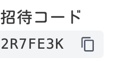
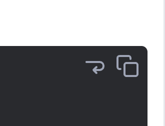

Hello! I'm [@Ryo54388667](https://x.com/Ryo54388667)! ☺️

Here are the May release notes!

After Golden Week ended, development resumed in full swing. This month saw significant progress in both **internationalization (i18n)** and **UI/UX improvements**, enhancing both quality and usability. The multilingual support implementation, in particular, establishes a crucial foundation for the blog's global expansion.

## Application Updates

### Internationalization (i18n) Implementation 🌍

To expand the blog globally, we've finally implemented **internationalization support**! Users can now switch between Japanese and English, allowing us to deliver technical information to a broader audience.

**Key Implementation Features:**

- Locale-based routing using Next.js 14's App Router
- SEO-optimized URL path structure: `/ja/blogs`, `/en/blogs`
- Multilingual support for header navigation, footer, and search functionality
- Internationalization of category names and article metadata

```typescript title="language-switch.tsx"
// Language switching implementation example
const switchLanguage = (newLocale: string) => {
  const currentPath = pathname.replace(`/${locale}`, '')
  router.push(`/${newLocale}${currentPath}`)
}
```

After implementation, I thought "the language switcher might be too prominent..." and adjusted it to match the product's color and tone 😇 We ultimately settled on a more natural and user-friendly UI design.

**SEO Benefits:**

- Search engine optimization for each language
- Proper multilingual site recognition through hreflang attributes
- Language-specific OpenGraph image generation

### Code Block Feature Enhancement 💻

We've added convenient features to code blocks, which are essential for technical blogs, to improve the developer experience.

#### Text Copy Button



<br />

Added a one-click code copy button. It's a subtle feature, but one that many readers requested 👌

```tsx title="copy-button.tsx"
// Copy functionality implementation
const copyToClipboard = async (text: string) => {
  await navigator.clipboard.writeText(text)
  setIsCopied(true)
  setTimeout(() => setIsCopied(false), 2000)
}
```

#### Text Wrap Button

Implemented functionality to wrap long lines of code for display. A user-friendly design for those who dislike horizontal scrolling.

<br />



```tsx title="wrap-button.tsx"
// Wrap button implementation
const toggleWrap = () => {
  setIsWrapped(!isWrapped)
}

// Dynamic CSS class switching
className={`${isWrapped ? 'whitespace-pre-wrap' : 'whitespace-pre'}`}
```

Initially, we displayed tooltips on click, but changed it to hover for a more intuitive UX.

### LLMs Integration Button Addition 🤖

Responding to the AI era, we've added an **LLMs (Large Language Models)** integration button to the header. This feature is for readers who want to dive deeper into article content with AI assistance.

**Implementation Features:**

- Transparent icon background supporting both dark and light modes
- Proper formatting of article content for AI tool integration
- User-friendly button placement and design

This feature enables readers who want to understand technical articles more deeply to use AI tools to advance their learning.

### List Marker Display Improvement 📝

Fixed an issue where list markers in custom list components would overflow beyond the left margin.

```css title="list-styles.css"
/* Before */
.custom-list {
  list-style: disc;
}

/* After */
.custom-list {
  list-style: disc;
  @apply list-inside; /* Added TailwindCSS list-inside class */
}
```

While a minor fix, this improvement significantly contributes to readability and layout stability. Such attention to detail leads to enhanced user experience.

## Infrastructure Updates

### Enhanced SEO Optimization 🔍

We implemented **URL path optimization**, changing category pages from query parameters to path parameters for a more search engine-friendly structure.

```plaintext title="url-structure.txt"
# Before
/blogs?category=tech&page=2

# After  
/blogs/tech/2
```

**Implementation Details:**

- Utilizing Next.js 14's Dynamic Routes
- 301 redirect processing from old URLs to new URLs
- Automatic sitemap updates
- Breadcrumb list improvements

We also implemented redirect processing that preserves existing links, achieving both SEO value inheritance and user experience.

### Build-time Optimization ⚡

We expanded the scope of **Static Site Generation (SSG)** to improve performance.

**Main Improvements:**

- Build-time generation of pagination pages
- Reduced initial access response time
- Build time optimization by removing unnecessary `revalidate` processing

```typescript title="static-params.ts"
// Page generation optimization
export async function generateStaticParams() {
  const totalPages = await getTotalPages()
  return Array.from({ length: totalPages }, (_, i) => ({
    page: (i + 1).toString(),
  }))
}
```

This significantly improved the perceived speed when users access the site.

### Deployment Configuration Improvements 🚀

To improve CI/CD pipeline stability, we implemented the following improvements:

- Optimized `deploy.yml` configuration
- Added build error pre-detection functionality
- Improved test execution processes
- Automatic rollback functionality for deployment failures

These improvements enable **safer and more stable deployments**. Not only improving developer experience but also significantly enhancing site availability.

## Next Month (June) Plans 📅

### Major Performance Improvement Project 🚀

Targeting **over 8 seconds of performance improvement**, we plan to implement the following optimizations:

- **Enable Text Compression** (2.25 seconds improvement expected)
- **CSS Optimization and Critical CSS Implementation** (1.8 seconds improvement expected)
- **HTTP/2 Enablement** (1.7 seconds improvement expected)
- **JavaScript Bundle Optimization** (1.05 seconds improvement expected)
- **Enhanced Image Optimization** (LCP improvement)

### New Feature Additions

**Most Read Articles Feature**

- Display popular articles using Google Analytics data
- Article recommendation functionality on category pages
- Promote inter-article navigation to increase dwell time

**Lighthouse CI Integration**

- Continuous performance monitoring in production environment
- Visualization of measurement results integrated with Notion API
- Quality management for both mobile and desktop

### UI/UX & Accessibility Improvements

- Color contrast fixes for "Read More" buttons
- Smartphone image display optimization
- CLS improvement through unified Skeleton components
- Proper ARIA role implementation

Next month will focus particularly on **performance improvements**, setting numerical targets for our efforts. Significant user experience improvements are expected!

## Summary

May achievements include:

- ✅ **Complete Internationalization (i18n) Implementation** - Foundation for global expansion
- ✅ **Code Block Feature Enhancement** - Improved developer experience
- ✅ **LLMs Integration Feature Addition** - Adaptation to the AI era
- ✅ **SEO Optimization** - Migration to search engine-friendly URL structure
- ✅ **Infrastructure Improvements** - Build and deployment process optimization

June will focus on **performance improvements** to create a faster and more user-friendly blog. We will continue striving to deliver better technical information to our readers.

Thank you for reading to the end! 🙏

If you have any questions or feedback, feel free to reach out on Twitter ([@Ryo54388667](https://twitter.com/Ryo54388667)). I want to write next month too. No, I will write. (probably) 😊
