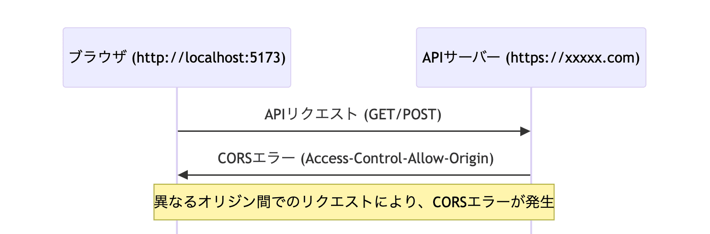
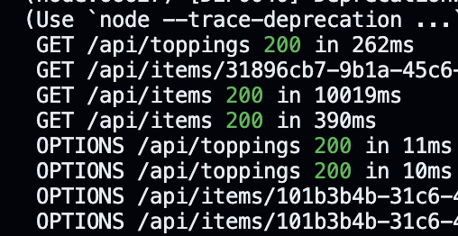

Hello! I'm [@Ryo54388667](https://x.com/Ryo54388667)!☺️

I work as an engineer in Tokyo. I mainly develop using TypeScript and Next.js. Today, I'll explain the causes and solutions for "CORS errors" that we often face, especially during API development!

<br />

## What is a CORS Error?

CORS (Cross-Origin Resource Sharing) is a mechanism to avoid security issues when exchanging resources between different domains. When you create an API and receive requests from external clients, if CORS is not properly configured, errors will occur in the browser.

For example, when a frontend app running on `http://localhost:5173` sends a request to an API at `https://xxxxxx.xxx/api/xxxxx`, if CORS settings are inappropriate, you might encounter errors like the following:

<br />



<br />

<br />

> register:1 Access to fetch at 'https\://xxxxxx.xxx/api/xxxxx' from origin 'http\://localhost:5173' has been blocked by CORS policy: Response to preflight request doesn't pass access control check: No 'Access-Control-Allow-Origin' header is present on the requested resource. If an opaque response serves your needs, set the request's mode to 'no-cors' to fetch the resource with CORS disabled.

<br />

I still run into CORS errors when integrating APIs... 😇

<br />

## Points to Check

### 1. Add CORS Settings to Response Headers

The first thing to check is whether the API server is returning the correct CORS headers. By setting these, you can allow specific domains and request methods.

Here's how to set CORS headers in Next.js Route Handler:

[https://nextjs.org/docs/app/building-your-application/routing/route-handlers#cors](https://nextjs.org/docs/app/building-your-application/routing/route-handlers#cors)

<br />

<br />

```typescript title="app/api/route.ts"
export const corsHeaders = {
  "Access-Control-Allow-Origin": "*", // Allow all origins
  "Access-Control-Allow-Methods": "*", // Allow all HTTP methods
  "Access-Control-Allow-Headers": "Content-Type, Authorization, X-API-KEY, Accept", // Allow necessary headers
};

// app/api/route.ts
return NextResponse.json({ status: 200, message: "Success" }, {
    status: 200,
    headers: corsHeaders
});
```

In the code above, by setting `Access-Control-Allow-Origin` header to `*`, we're accepting requests from any domain. You can also allow only specific origins as needed.

<br />

### 2. Allow OPTIONS Endpoint

Another cause of CORS errors is the "preflight request" using the OPTIONS method. Browsers send this request to the server before sending the actual request to confirm safety. If you don't return an appropriate response to this preflight request, errors will occur.

As shown in the image below, there are OPTIONS accesses:



<br />

It took me some time to notice this...

<br />

This article explains preflight requests clearly! 👏

[https://ja.javascript.info/fetch-crossorigin#ref-232](https://ja.javascript.info/fetch-crossorigin#ref-232)

<br />

To handle preflight requests, you need to allow the OPTIONS method. Here's an implementation example in Next.js!

<br />

```typescript title="api/route.ts"
export async function OPTIONS() {
  return NextResponse.json(null, {
    status: 200,
    headers: corsHeaders
  });
}
```

<br />

This allows the server to correctly return CORS headers in response to OPTIONS requests.

<br />

## Final Thoughts

**Solutions**

- Add CORS settings to response headers
- Allow OPTIONS endpoint

If you know any better methods, please let me know\~ 🙇‍♂️

<br />

Thank you for reading to the end!

I tweet casually, so please feel free to follow me! 🥺

<br />

> 書きました〜[https://t.co/BrKoNFsGDs](https://t.co/BrKoNFsGDs)
>
> — りょた@dev (@Ryo54388667) [September 1, 2024](https://twitter.com/Ryo54388667/status/1830174390618935405?ref_src=twsrc%5Etfw)

<br />

If this article helped you, I'd be moved to tears if you'd send a tip (an Amazon gift card) from my wish list 🥺

<LinkCard url="https://www.amazon.jp/hz/wishlist/ls/2FEMYG87ZXIME?ref_=wl_share" />
