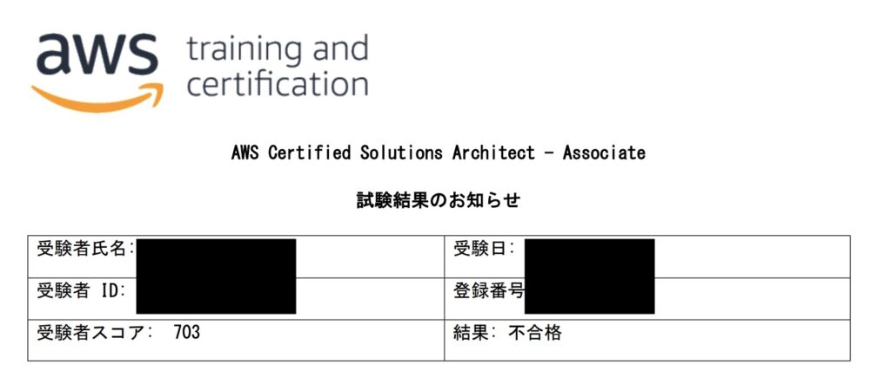

## My Experience Level Before Taking the Exam

There are various opinions about the AWS SAA exam on the web.

- I passed with 5 hours of study.
- It's incredibly easy.

These opinions might be true, but they're not useful for everyone. The people making such statements are probably already familiar with AWS services or well-versed in infrastructure knowledge. In other words, **the difficulty of passing depends on your experience level**.

 

So first, let me introduce my experience level before taking the exam.

- My job is frontend engineer. I mainly write TypeScript.
- I don't touch AWS at all in my daily work. Infrastructure engineers create architecture diagrams, so I only look at them occasionally.
- I have zero knowledge of networking. SSH, HTTPS - what are those delicious things?

Honestly, it wouldn't be an exaggeration to say I started from level 0. I'd be very happy if this helps readers with similar experience levels.

 

Here's the actual exam result image!

**The passing line was 720 points, and I got 703 points!**

 

"Just 1 or 2 more questions!! Seriously...!"

"Isn't there something like a last-minute pass...?"

 

 

Unfortunately, I failed.

I want to write this article to put these feelings to rest...

 

## What I Studied Before the Exam

First, let me give you the big picture.

- Study period: 2.5 months
- 1 book
- Udemy practice tests
- [CloudTech](https://kws-cloud-tech.com/) problem sets

It was like this. Not very unique, sorry. Next, I'll write the details chronologically.

 

First, I grasped the overview with a book.

Since I didn't even know what services existed, I roughly studied "what services" are used "for what purpose". The book I actually used was this one:

[Pass with this one book! AWS Certified Solutions Architect - Associate Text & Problem Set](https://amzn.asia/d/drx8JhS)

 

It took me 1.5 months to input all of this. I studied for 1 hour every weekday.

**Around this time I booked the exam!** I chose the online exam. Even a month in advance, most weekend time slots are already filled, so I recommend booking early!

 

The remaining month was spent just solving practice problems.

I solved CloudTech's free 200 questions, noted wrong question numbers in a spreadsheet, and solved them again several times.

 

I also repeatedly solved [Udemy practice tests](https://www.udemy.com/course/aws-knan/). It was good to experience the feel of exam timing. For reference, here's my practice test score progression before the exam:

| Test | 1st time | 2nd time | 3rd time |
| ------ | -------- | -------- | -------- |
| 1      | 47%      | 73%      |     |
| 2      | 36%      | 56%      | 80%      |
| 3      | 44%      | 73%      | 81%      |
| 4      | 44%      | 61%      | 78%      |
| 5      | 43%      | 69%      |     |
| 6      | 43%      | 73%      |     |

In the latter half, since I was doing only output and wanted some input too, I purchased [Udemy's intensive video course](https://www.udemy.com/course/aws-associate/). I installed the Udemy smartphone app, downloaded videos to my phone, and studied by playing them offline while running.

 

I was able to balance input and output well, and felt that I could choose correct answers from options while reasoning through Udemy practice tests.

This is the timeline of how I progressed with my studies.

 

## What I Noticed After Taking the Exam. What I Wanted to Know Before the Exam.

Here's what I noticed after actually taking the exam.

### ① The exam app was extremely slow.

I took the exam online using an app called Pearson View. This app was terribly slow. I think it probably sends every single user input via asynchronous communication.

 

"Click. loading... Click. loading..."

 

It was like this. While my environment might have been partly to blame, it was frustratingly slow. **I recommend using a wired connection if possible! Best is to take the exam at an offline venue.**

 

### ② No need to bring a timer.

When I clicked "Next", I was worried about whether there was a timer, but the remaining time was displayed, so I was relieved. In my case, when I finished 65 questions, I had 20 minutes left. I recommend taking the exam thinking you don't have abundant time remaining.

 

### ③ You can mark questions for "review later".

This was a helpful feature. When you finish the last question, a list of questions you marked for "review later" is displayed.

However, as mentioned earlier, the app speed is "extremely slow", so be careful. If you mark all uncertain questions for "review later", you might run out of time. I recommend distinguishing between "questions you can figure out if you think about them" and "services you've never heard of" that you can't understand even if you think about them, and marking only the "questions you can figure out if you think about them" for "review later".

 

## Finally

I wrote this sad failure experience report. Since I prepared quite a bit, the shock was huge...

Honestly, since I was just a few questions away from passing, I think I'll pass if I challenge it a few more times. I want to retry in a month. Along with that, I'll also study for the higher-level AWS DVA certification!

I forgot to mention, but [this site](https://mondai.ping-t.com/g/passings) was also helpful. It collects various people's passing experience reports, so it's very useful.

 

AMAZON

[\
この1冊で合格! AWS認定ソリューションアーキテクト - アソシエイト テキスト&問題集](//af.moshimo.com/af/c/click?a_id=2351007\&p_id=170\&pc_id=185\&pl_id=4062\&url=https%3A%2F%2Fwww.amazon.co.jp%2Fdp%2F4046042036)

<AmazonLink href="//af.moshimo.com/af/c/click?a_id=2351007&p_id=170&pc_id=185&pl_id=4062&url=https%3A%2F%2Fwww.amazon.co.jp%2Fdp%2F4046042036" image="https://images-fe.ssl-images-amazon.com/images/I/51Xn-pPCdiL._SL160_.jpg" title="この1冊で合格! AWS認定ソリューションアーキテクト - アソシエイト テキスト&問題集" trackingImage="//i.moshimo.com/af/i/impression?a_id=2351007&p_id=170&pc_id=185&pl_id=4062" />
