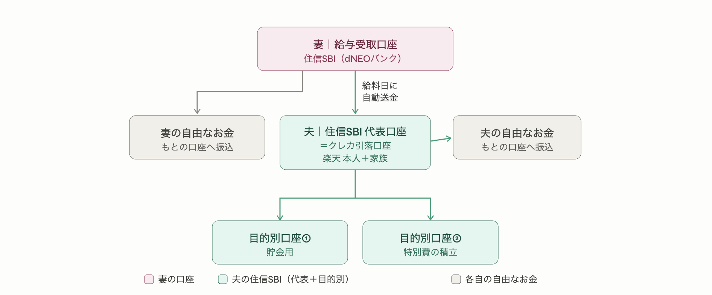
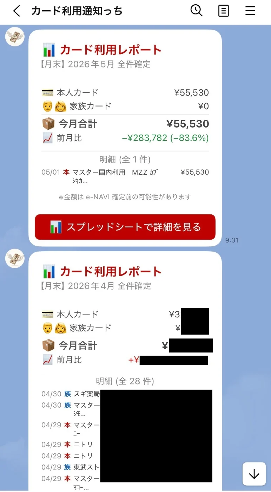
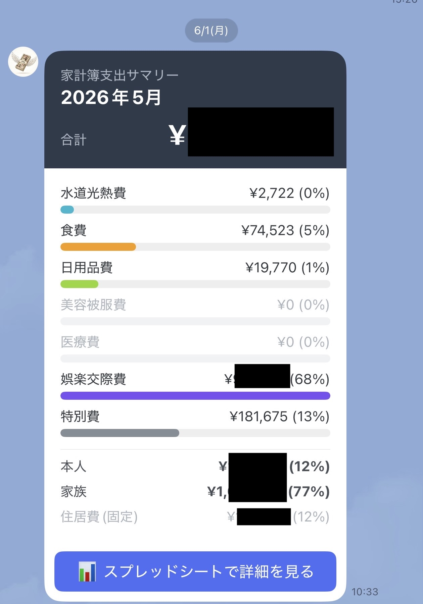
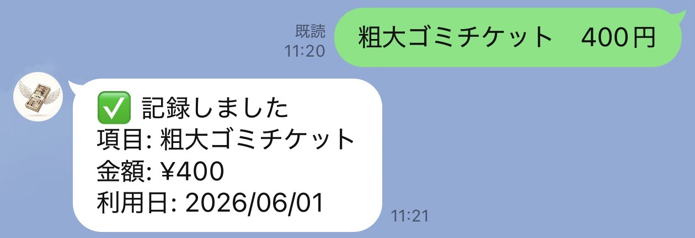

Hello! I'm [@Ryo54388667](https://x.com/Ryo54388667)!☺️

I usually work as an engineer in Tokyo! I mostly touch technologies like TypeScript and Next.js.

This time I'm switching things up a bit, and sharing the whole household-money system my wife and I (two of us, no kids) run together!

Lately, people around me keep asking about this. "Now that you're married, how do you manage your money?" So this time I'll do it in interview format — answering a listener's questions, laying everything bare from bank accounts to cash management.

This article is written for people like:

- Couples about to move in together or get married, both working
- People who find money management a pain and have never managed to stick with a budget
- Engineers who think "I want to systematize my household finances too"

It's less a perfect budgeting technique and more "a system even a lazy guy like me has kept up." You don't have to copy it exactly — if you walk away with just the ideas you can use for a dual-income household, that's plenty. Let's get into it!

> Note: This article contains affiliate ads (PR) for services I actually use. Everything I introduce is something I tried in my own household and genuinely liked.

## The Whole System in 30 Seconds

Before the details, let me put the big picture up front.

| Layer         | What it does                                                  | Keywords                                               |
| ------------- | ------------------------------------------------------------- | ------------------------------------------------------ |
| Accounts      | Split accounts by role so money flows automatically on payday | SBI Sumishin, purpose-specific accounts, auto-transfer |
| Card spending | Auto-collect Rakuten Card statements and notify via LINE      | auto-scraping, spreadsheet                             |
| Cash spending | When you pay cash, just send one LINE message to log it       | LINE, AI auto-categorization                           |

In a nutshell, the design philosophy running through all of it is: **"Automate everything that can be automated, and for cash — which can't be — capture it with the absolute minimum effort."** That's it. Because I stuck to this, even a lazy guy like me has kept it going for three months.

Alright, let's dig in one by one!

## An Automated Bank Account System 🏦

**——So, what made you start building this household system?**

Simply put, I got married this year.

When I was single, I just spent the money in my own account, so honestly I managed nothing. But once you're a couple, you have to separate "shared money the two of you use" — rent, daily necessities — from "money each of you spends freely."

"If I leave this alone, we'll definitely end up fighting about money," I thought, so I rebuilt everything from scratch when we got married. I've been running it for about three months now.

**——What's your work setup?**

We're both working, both company employees, and no kids yet. So it's the fairly common dual-income couple shape: "two incomes, moderate fixed costs, and we each want our own free spending money."

**——How do you split the accounts?**

The main character is SBI Sumishin Net Bank. My wife's side and my side each have a role.

Put into words, the money flows like this:

```
[Wife] SBI Sumishin (dNEOBANK) = salary-receiving account
   ├─ (auto-transfer on payday) → a fixed living-cost amount to husband's SBI Sumishin account
   └─ (transfer) → wife's original account (her own free money)

[Husband] SBI Sumishin = the household hub account (= the card-payment account / Rakuten Card: main + family)
   ├─ Purpose-specific account ①: savings
   ├─ Purpose-specific account ②: special-expense reserve
   └─ (transfer) → husband's original account (his own free money)
```

Here's the flow diagram!

<br />

<br />



My wife's salary first lands in her SBI Sumishin, and on payday a fixed living-cost amount is automatically sent to my SBI Sumishin. She moves the rest to her own account to spend freely. My account is the household hub, and from there I run card payments, savings, and the special-expense reserve.

**——The "auto-transfer" sounds like the key.**

Exactly. This is what I most want to convey: I've set it so that a fixed amount is automatically transferred from my wife's SBI Sumishin to mine on payday. Set it once, and the money moves on its own every month. Everything from income to setting aside living costs completes without human hands.

And the great thing about SBI Sumishin is that transfers to other banks are free up to a few times a month. The part that quietly matters most: **transfers even to a different account holder (i.e., family) are also fee-free.** When a couple splits accounts and moves money around, these transfer fees land like body blows. Having that cost be zero every month is the foundation that makes this whole system work.

Incidentally, the bank I use here is [SBI Sumishin Net Bank (NEOBANK)](https://netbk.jp/3XEebP5). The purpose-specific accounts coming up next, and the free transfer/ATM allowances, are all built on this bank's features, so as the foundation of a household it's pretty excellent.

**——Purpose-specific accounts came up too.**

Another favorite SBI Sumishin feature: within a single account you can create as many "purpose-specific account" compartments as you like. I split mine into "savings" and "special-expense reserve." Appliances break, unexpected costs always come up, right? I cover those from the special-expense bucket.

One caveat: the card-payment account can't be a purpose-specific account. Withdrawals come from the representative account — that's how it's partitioned — so this tripped me up at first😅 "I want to pay the card from my savings purpose-account, but I can't set it up…?"

**——What about credit cards?**

Household spending is basically consolidated onto a Rakuten Card. I have the main card and my wife has a family card, so both our payments land on one card (the same bill).

This way, the couple's spending collects into a single statement, which makes the "transparency" I'll talk about next much easier. The card I use is [Rakuten Card](https://r10.to/h8SPIf); the family card has no annual fee either, so the bar to consolidating a couple's spending is low (right now you can get 11,000 points for signing up and using it). Other cards usually offer family cards too, so you can build the same idea with them.

## Making Spending Transparent 🔍

**——This feels like the main event. Why did you want to make spending "transparent" in the first place?**

Three reasons.

First, when you don't know what the other person spent on, it's surprisingly hard to ask. "Hey, what's this charge?" — checking every time feels awkward for both the asker and the asked, doesn't it?

Second, unlike single life, we now need to manage shared things the two of us use (daily necessities and such) separately. I wanted to cleanly separate "this is our living cost" from "this is personal hobby spending."

And third, minimum running cost. This is my obsession across every section: a system that "only works if you try hard" will never last. I've installed budgeting apps many times and stopped opening them after three days, over and over😅 So this time my goal was a state where "it visualizes itself even if I do nothing."

**——Concretely, how do you "visualize" it?**

**Here's what the final LINE notification looks like!**

<br />



<br />

I built a system that automatically fetches my Rakuten Card statements, records them in a spreadsheet, and notifies us on LINE. A truly serious waste of engineering skill (lol).

The core flow looks like this:

```
Rakuten Card statement
   ↓ (fetched automatically)
Recorded in a Google Spreadsheet
   ↓ (aggregated automatically)
LINE notification to both of us: "here's how much we've spent this month"
```

To fetch the statements I use a browser-automation tool (called Playwright), which grabs the usage data from Rakuten's statement page and writes it to a Google Spreadsheet — and I run that automatically on my own Mac. Twice a month — mid-month (around the 15th) and at month-end — "how much we've spent so far" flies into LINE. A quick-report, basically.

I'll skip the nitty-gritty code since it gets maniacal fast, but roughly: "the tedious statement-checking a human would do is offloaded to a machine."

**——You collect it in a spreadsheet — but it doesn't end there, right?**

Right. This is my favorite part: separate from the twice-a-month quick reports, on the 1st of every month I push a "finalized report" that sums up the previous month's spending by category. This is automated with a routine too, and the kicker is that **the categorization is done by AI.**

Here's what it does:

- Reads all of last month's statements collected in the spreadsheet
- For spending without a category yet, the AI auto-sorts it from the store name (into 7 categories: food, utilities, daily necessities, beauty & clothing, medical, leisure & social, and special expenses)
- Writes the categorized results back to the spreadsheet
- Turns each category's total into a report with a bar chart and notifies us on LINE (both of us get the same thing)

Fixed costs like rent are held separately as a fixed amount from the start; only variable costs go into the chart.

Here's what the screen looks like!



On the 1st, I open my phone and "how much we spent in each category last month" has arrived on LINE with a bar chart. The feeling of keeping a budget is zero, yet the budget is finished on its own — I love it🎉 Thanks to this, conversations like "we spent quite a bit on leisure & social this month, huh" now come up naturally between us. That's exactly the "transparency" I was after.

**——Having AI do the categorization feels very current.**

Right?! Sorting like "7-Eleven → food" or "Matsukiyo (a drugstore) → daily necessities" — if you write rigid rules, exceptions come up endlessly. But if you ask an AI to "judge from the store name and put it into one of these 7 categories," it lumps things together nicely. As long as you set just one rule — "when in doubt, dump it into special expenses" — the operation never breaks down.

And this aggregation processes a few dozen items a month, so the AI cost is on the order of a few yen a month. It fits the minimum-running-cost philosophy perfectly.

## Managing Cash Spending 💴

**——So far it's been accounts and cards. But cash always remains, right?**

It does. Even living mostly cashless, cash never hits zero. In my case:

- Buying oversized-trash collection tickets (the kind you buy with cash at a convenience store)
- Paying at cash-only restaurants

These are the spots that inevitably slip out of cashless.

This is the biggest headache. Cards can all be made transparent automatically, but cash alone slips out of the system. And piling up receipts to hand-enter them at month-end? I'm fully confident I'd never keep that up (lol).

**——So how do you manage that cash?**

I solved this with a system too: **when you pay cash, you just send one message to LINE.**

For example, if I eat lunch at a cash-only place, I just send this to our budgeting LINE account:

```
Lunch 1200
```

That's it. Behind the scenes:

- The AI parses the LINE message and extracts "item = Lunch," "amount = 1,200 yen"
- It auto-records that to the Google Spreadsheet (the same one as the card statements)
- LINE replies "✅ Recorded"

Whether it's "Movie 2000," "￥1,200 lunch," or "yesterday's gas 4500 yen," the AI reads it nicely even if the formatting varies, so not having to worry about format is what makes it easy.



And the cash spending recorded here merges with the card statements and gets mixed into the monthly category report properly. So both card and cash collect into a single budget. In the end, you can see all of the couple's spending just by looking at this one spreadsheet.

**——How do you finally settle the cash one of you fronted?**

The monthly category report also shows who fronted how much in cash, so we settle based on that. The timing is around payday, and there are two ways: transfer the fronted amount from the shared household account (my SBI Sumishin hub account) to each person's account, or withdraw it in cash.

Here too SBI Sumishin helps: ATM withdrawals are also free up to a few times a month. So "you can pay it back by transfer, or just whip it out at an ATM" — you choose by whatever's convenient at the time. Both transfers and ATM being fee-free quietly removes the stress of settling.

**——Honestly, that "one LINE message" is effort too, isn't it? Are you keeping it up?**

Such an essential question (lol).

Honestly, this is a compromise of "I can keep up this much effort." Ideally I'd automate cash too, but it's physically impossible. So I thought about how small I could make the effort left to a human — and the answer was "one LINE message."

Open a budgeting app, pick a category, type the amount, hit save… and I'll definitely stop doing it. But "just mutter one line in LINE" — I can type it right there the moment I leave the store. Since I open LINE every day anyway, there's no new app to learn. Putting it onto something already in your daily flow — that's the trick, I think.

Of course, I do forget to send it sometimes😅 But if I miss a record, the couple's settlement goes off, and in the end I'm the one who loses out. So maybe because "forgetting costs you" works, both of us have been sending them reliably so far. Rather than aiming for a perfect system, designing it so "slacking off costs you" might be what matters most for keeping it going.

## Wrapping Up 📝

**——To recap, what's the single biggest point of this system?**

What runs through all of it is "minimum running cost."

- Accounts: set them once, and money flows automatically every month (SBI Sumishin's auto-transfer + purpose-specific accounts)
- Card spending: leave it alone and statements gather into a chart (auto-fetch + AI categorization)
- Cash only: capture it with one line on LINE, which is already in your daily flow

Automate what can be automated, and for cash that can't be, the minimum effort. Drawing that line clearly is, I think, the biggest reason a lazy guy like me has kept it going.

It took three months to finish, with a few rebuilds along the way, but looking back I genuinely think "I'm glad I built this when we got married." It's infrastructure for the couple, so to speak — to keep money from causing friction.

**——What do you want to take on next?**

Next I want to systematize asset management. In particular, **how to fit a NISA account into the household system** is something I haven't figured out yet, and it's a theme I want to face properly going forward. Visualizing spending is well in shape now, so next I want to move on to building a system for "how to grow the money we've saved." Once the accounts side settles, I plan to write about systematizing investing too.

And above all, I'd be happy if this helps people who are struggling with how to spend their money, or who are simply interested in household systems. You don't have to copy all of it — if you take home just the idea of "automate what can be automated, and the rest with minimum effort," that's a huge success😊

The visualization setup I introduced here (the Rakuten statement auto-fetch part) was a pretty fun technical adventure, so I'm planning to write a separate article digging a bit deeper.

### Services I Use in This System

Finally, let me list the services I'm using as the foundation of my household system. Both can be started for free, and after three months of use these are the ones I genuinely thought were good.

- Bank: [SBI Sumishin Net Bank (NEOBANK)](https://netbk.jp/3XEebP5) — purpose-specific accounts, auto-transfer, and free transfer/ATM allowances are the foundation of household automation. Open an account via the app from the new-account button on the campaign page, and enter referral code "<Copyable>s9G1RfA</Copyable>" at the end to receive a perk.
- Card: [Rakuten Card](https://r10.to/h8SPIf) — main + family cards consolidate a couple's spending onto one card. Right now there's 11,000 points for new sign-up & use.

If you have a better way to manage household finances, please let me know〜

Thank you for reading to the end!

I tweet whatever's on my mind, so feel free to follow me!🥺
