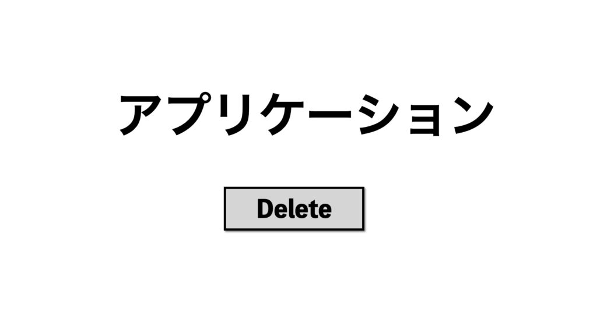
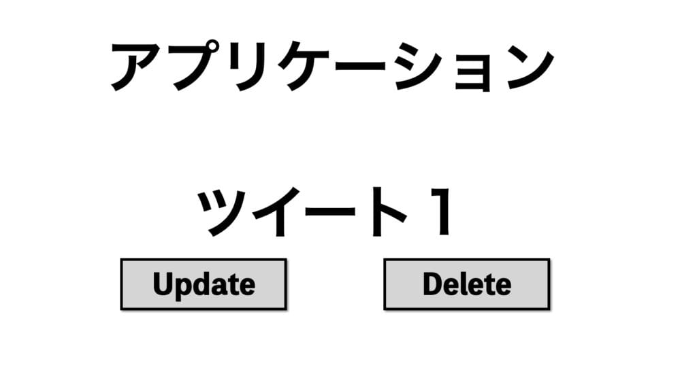

## What Motivated Me

Usually when creating apps, I casually think about screen layouts and page transition flows, but at some point, I realized that my design rationale was "because this is a common design in other apps".

 

While it's sometimes necessary to imitate other apps, it's not good to design while completely stopping thinking. There must be some important theory, I thought, so I researched design patterns. That's where I encountered "Object-Oriented UI".

 

I immediately purchased a book and studied it, so I'll write this as output.

By the way, the book I'm quoting from is this:

 

AMAZON

[\
オブジェクト指向UIデザイン──使いやすいソフトウェアの原理 (WEB+DB PRESS plusシリーズ)](//af.moshimo.com/af/c/click?a_id=2351007\&p_id=170\&pc_id=185\&pl_id=4062\&url=https%3A%2F%2Fwww.amazon.co.jp%2Fdp%2F4297113511)

## What is Object-Oriented UI

 

Let me introduce the definition of the term.

> Object-Oriented UI is UI designed with objects as clues for operation. The methodology that uses objects as clues to map screens and data when determining application UI structure is Object-Oriented UI design.
>
> (Object-Oriented UI)

When I first read this, I didn't get it (^^;

Objects are "things". However, this includes conceptual things too. For example, "users," "groups," "departments," etc.

In other words, it's "noun-centered operation design."

To understand Object-Oriented UI, it helps to think about what is NOT Object-Oriented UI. For example, if there was an app screen like this, what would you think?

"What is this Delete button?! What does it delete?"

 

Wouldn't you think this? **This "what" part is very important.** In this application's case, the "what" - the object - is decided after pressing the button. **The problem with this design is that you can't imagine what happens after the operation until you press the button.**

 

Now, what if there was this screen instead?

"I can update or delete Tweet 1, right?"

You can vaguely understand this, I think.

 

This is Object-Oriented UI design - choosing the object first, then choosing the operation. Personally, I thought "I see!"

 

## Finally

 

I briefly introduced Object-Oriented UI.

After learning this, instead of "because that's how it's usually done," I started designing based on Object-Oriented UI rationale. The book also has sections with UI design exercises where you can experience the process of thinking about actual application UI.

 

It's a book for leveling up from "someone who thinks about screens casually" to "someone who can think about UI design with methodology and follow it." It was a very readable book. If you want to know more details, please definitely pick it up (^^)

<AmazonLink href="//af.moshimo.com/af/c/click?a_id=2351007&p_id=170&pc_id=185&pl_id=4062&url=https%3A%2F%2Fwww.amazon.co.jp%2Fdp%2F4297113511" image="https://images-fe.ssl-images-amazon.com/images/I/417gFPF5omL._SL160_.jpg" title="オブジェクト指向UIデザイン──使いやすいソフトウェアの原理 (WEB+DB PRESS plusシリーズ)" trackingImage="//i.moshimo.com/af/i/impression?a_id=2351007&p_id=170&pc_id=185&pl_id=4062" />

If this article helped you, I'd be moved to tears if you'd send a tip (an Amazon gift card) from my wish list 🥺

<LinkCard url="https://www.amazon.jp/hz/wishlist/ls/2FEMYG87ZXIME?ref_=wl_share" />
