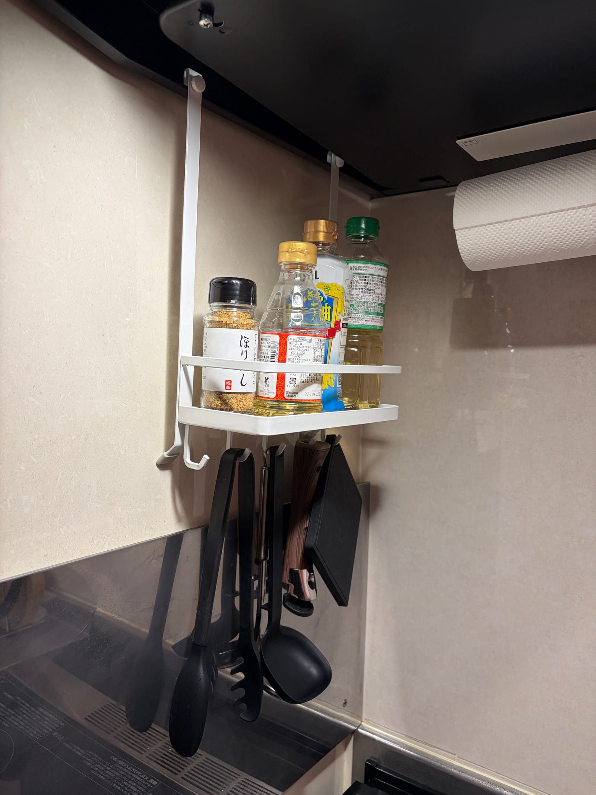
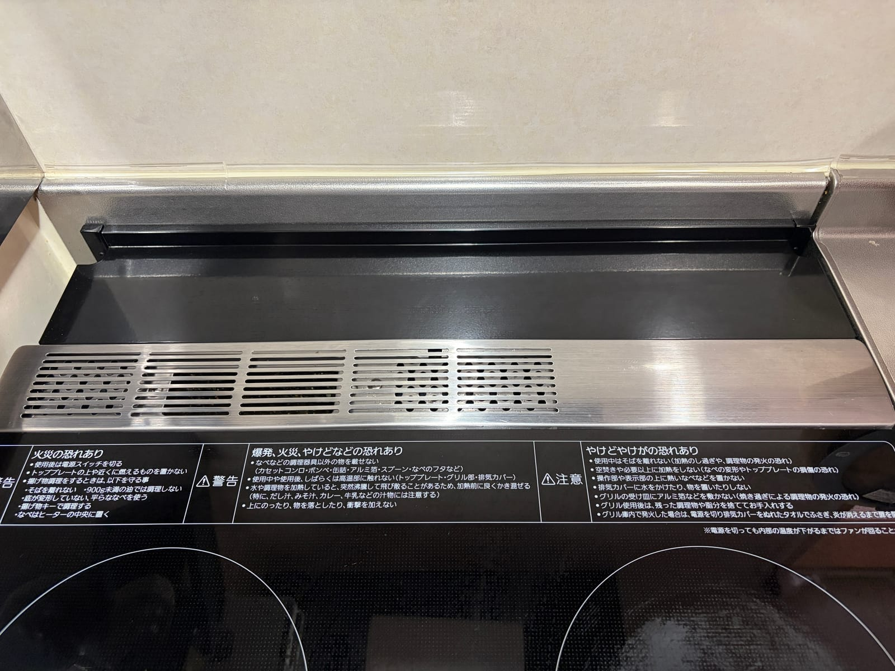
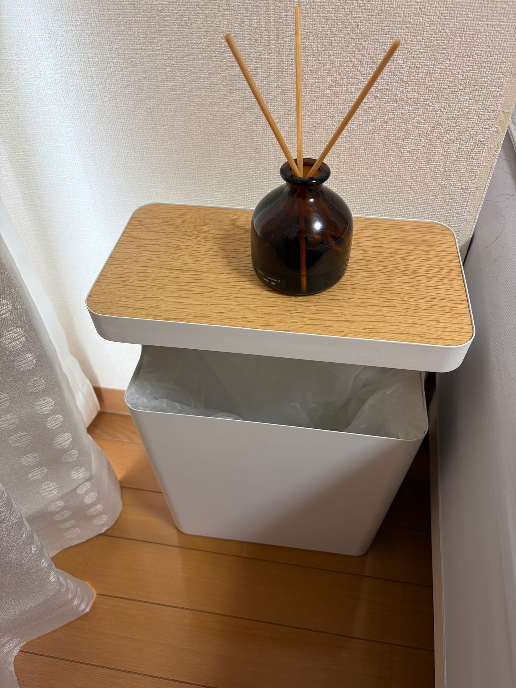

こんにちは！[@Ryo54388667](https://x.com/Ryo54388667)です！☺️

普段は都内でエンジニアとして働いています！

今回は技術の話ではなく、**4年半かけて買い集めた山崎実業のアイテムを本音でランキング** していきます！

一人暮らし時代の2021年に初めてtowerシリーズを買ってから、結婚して二人暮らしになった今の新居まで、気づけば10商品も買っていました。

Amazonの購入履歴をさかのぼりながら、「これは買ってよかった」と胸を張れる8つと、正直失敗だった1つを紹介します。

## 4年半で買った山崎実業を全部並べてみた

まずは購入履歴の全体像です。日付はAmazonの注文履歴そのままです。

| 商品 | シリーズ | 購入時期 | 現在の価格帯 |
|---|---|---|---|
| シンク扉タオルホルダー(白) | アクア | 2021年11月 | 約1,000円 |
| マグネットストレージラック | tower | 2021年11月 | 約1,300円 |
| シリコーンお玉 | tower | 2022年3月 | 約1,300円 |
| シリコーン菜箸トング | tower | 2024年6月 | 約1,200円 |
| シンク扉タオルホルダー(黒)×2 | tower | 2025年7月 | 約1,000円 |
| レンジフード調味料ラック | Plate | 2026年4月 | 約3,000円 |
| コンロ奥 隙間ラック | tower | 2026年4月 | 約3,600円 |
| 戸棚下ハンガー | Plate | 2026年4月 | 約1,200円 |
| 天板付きトラッシュカン | RIN | 2026年5月 | 約6,500円 |
| マグネット折り畳みドアストッパー | smart | 2026年7月 | 約1,500円 |

こうして見ると、2026年の春に一気に増えてますね😅

結婚して新居に引っ越したタイミングで、キッチンまわりを整えるために買い足したのがこの時期です。

一方で、2021年に買ったタオルホルダーとマグネットラックは、引っ越しを挟んで今も現役です。この「長く使っても壊れない」感じが山崎実業の良さだと思っています。

## 買ってよかった山崎実業ランキング

前置きはこのくらいにして、ランキングにいきます！

### 1位: レンジフード調味料ラック(Plate)

ベスト1はこれです。**設置は換気扇のフチに掛けるだけなのに、コンロまわりの一等地が調味料置き場に変わります。**

うちのキッチンは調味料の置き場所に困っていて、コンロ横に直置きしていた時期もありました。油で汚れるんですよね。。

このラックを付けてからは、「いま使う調味料を探して振り返る」という動きが調理中から消えました。欲しいものは目の前にあるので。

実は[2026年上半期のベストバイ記事](/ja/blogs/zakki/best-buy-2026-first-half)でも家全体の9位に入れたのですが、あれから3ヶ月以上使い込んで、キッチン部門では文句なしの1位になりました。

価格は3,000円前後です。工具も不要で、引っ掛けるだけで設置が終わります。

<MoshimoAffiliate id="0" />

### 2位: コンロ奥 隙間ラック(tower)

コンロの奥の隙間に「置くだけ」のラックです。

コンロと壁の間って、放っておくと油ハネと謎のゴミが溜まりませんか？

このラックを置いてからは、油もゴミも下に落ちなくなりました。ガード役をしつつ、調理中のフライパンや調味料の一時置き場としても使えます。

掃除もラクになりました。ラックごと持ち上げて拭けば済むので、コンロ奥に手を入れるハードルが一気に下がりました。

3,600円前後。固定なしで置くだけなので、賃貸でも気兼ねなく使えます。

<MoshimoAffiliate id="1" />

### 3位: 天板付きトラッシュカン(RIN)

ゴミ箱とサイドテーブルが合体した、RINシリーズのトラッシュカンです。

うちでは寝室のデスク横に置いています。天板に飲み物を置けて、下はゴミ箱という一台二役です。

このゴミ箱、袋が完全に隠れる構造になっています。ゴミ箱ってどうしても生活感が出るのですが、これは木の天板とスチールの本体で、ぱっと見は小さなサイドテーブルにしか見えません。

6,500円前後と、山崎実業の中ではやや高めです。それでも寝室の見た目が締まったので、うちでは満足度の高い買い物でした。

<MoshimoAffiliate id="2" />

### 4位: マグネットストレージラック(tower)

2021年11月に買って、4年半以上現役の古参です。

磁石でくっつく面ならどこでも小物の定位置を作れるラックで、フック付きなので引っ掛け収納もできます。

一人暮らし時代から引っ越しを挟んで使い続けていますが、マグネットがヘタる気配はないです。4年半使ってこの耐久性なら文句なしです。

1,300円前後。towerのマグネットシリーズの入門としてもちょうどいいと思います。

<MoshimoAffiliate id="3" />

### 5位: シンク扉タオルホルダー(tower)

実はこれ、歴代で3個買っています笑

最初は2021年にアクアシリーズの白を買いました。4年近く使って不満はなかったのですが、新居のキッチンを黒で揃えたくなり、2025年にtowerの黒を2個買い足しました。

色を替えてまで同じ形を買い直すくらいには、使い勝手が気に入っています。

シンクの扉に引っ掛けるだけで、手拭きタオルの定位置ができます。1個1,000円前後なので、山崎実業の入門としては一番手を出しやすいと思います。

<MoshimoAffiliate id="4" />

### 6位: シリコーンお玉(tower)

2022年3月から4年使っているお玉です。

先端がシリコーンなので鍋を傷つけず、フチにそわせてすくいやすい形状になっています。内側に計量メモリが付いているのも便利です。

4年使って、シリコーンが欠けたり変色したりはしていません。調理器具は消耗品だと思っていたので、これは思ったより長持ちしています。

1,300円前後です。

<MoshimoAffiliate id="5" />

### 7位: シリコーン菜箸トング(tower)

菜箸とトングの2wayになっている調理器具です。2024年6月から2年使っています。

パスタを掴むときはトング、炒め物は菜箸、と1本で切り替えられるので、調理器具の数を減らせます。

滑りにくくて熱に強いシリコーンなので、フライパンに当たっても気を使わなくていいのがラクです。

1,200円前後です。

<MoshimoAffiliate id="6" />

### 8位: 戸棚下ハンガー(Plate)

戸棚の底板に差し込むだけで、吊り下げ収納を作れるハンガーです。2個組で1,200円前後。

2026年4月から使っています。戸棚の下という完全なデッドスペースに引っ掛け場所が生えるので、費用対効果は十分でした。

順位が8位なのは悪いからではなく、上位陣のインパクトが強すぎたからです。。

<MoshimoAffiliate id="7" />

## 失敗だった商品も正直に書きます

ここまで褒めてばかりなので、期待外れだった商品も正直に書きます。2026年7月に買った、smartシリーズのマグネット折り畳みドアストッパーです。

結論から言うと、**うちの玄関ドアではストッパーとしてほぼ機能しませんでした。**

ドアを止めようとするとストッパーがズレるんです。位置を微調整しながらであれば止まるのですが、「サッと止めたい」というドアストッパー本来の目的からすると本末転倒です。。

マグネット自体は強力で、ドアに付けたままにしておく分には邪魔にならないので、今も一応付けたままにしています。ただ「買ってよかったか？」と聞かれると、うちでは No です😇

ドアの材質や形状との相性もあると思うので、買う前に玄関ドアの下側の形状を確認することをおすすめします。

<MoshimoAffiliate id="8" />

## まとめ

4年半分の山崎実業の購入履歴を振り返りました。

- 1位のレンジフード調味料ラックと2位のコンロ奥ラックは、キッチンに立つ回数が多い人ほど効きます
- 2021年組(タオルホルダー・マグネットラック)は4年半使っても現役で、耐久性は折り紙付きです
- ドアストッパーだけは、うちの玄関ドアとは相性が合いませんでした

山崎実業は1,000円台から試せるので、まずはタオルホルダーあたりから入るのがおすすめです。

みなさんの「これも買ってよかった」があれば、ぜひ教えてください〜

最後まで読んでいただきありがとうございます！

気ままにつぶやいているので、気軽にフォローをお願いします！🥺
